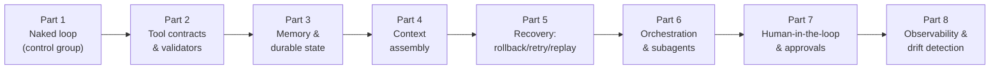

# The Naked Agent: Why Your Framework Hands You a Loop, Not a Harness

Part 1 of Rick Hightower's "Harness Engineering, Two Frameworks" series — the deliberate
*control group*. It strips an agent of every safety control so you can feel where
production agents fail before learning how to fix them.

The opening story: a real user typed `"March 32nd"` into a travel-booking agent. The model
passed it straight to the flights API; forty minutes and ~$50 of model calls later, someone
was explaining a phantom booking to a customer who'd already been told they were "all set."
The model didn't hallucinate — it dispatched exactly what it was told to. **The harness had
no opinion.** The model supplies intelligence; the harness supplies discipline.

## The reframe most people miss

Reaching for a framework does *not* close the safety seams. The Claude Agent SDK and
LangChain Deep Agents hand you a better-built *loop* — a real tool protocol, a clean
execution path — but by default **no validators, no memory you can reason about, no
recovery**. In Deep Agents, for example, `create_deep_agent()` returns a compiled graph;
with no checkpointer passed, it forgets everything between invocations, and tool bodies run
destructive side effects the moment the model selects them. Both frameworks give you a
clean loop and zero discipline. That gap is not a flaw in the tools — it *is* the work.

## The naked loop breaks three ways

1. **No iteration cap → runaway loops.** Nothing bounds how many times the loop turns.
2. **Context blows up, quality degrades silently.** The naked loop resends the entire
   message history every turn. A long conversation climbs past ~50k tokens; nothing trims
   it; quality decays via *context rot* and the agent starts skipping steps it handled
   cleanly earlier — **no error, just a quietly worse agent.** This points to *memory /
   durable state* and *context assembly*.
3. **A tool errors, the agent reports success.** A tool returns an error payload and the
   model composes a polite summary that elides the failure — "agents are confident liars";
   a query returning zero rows gets read as a factual answer, not a miss. The hard problem
   is detecting the difference between a tool that *succeeded* and one that *plausibly
   mimicked success*. This points to *observability and drift detection*.

Read these as a diagnostic pattern, not a list of shame: in all three the model did what
models do, and the system around it failed to catch it. None is a story about a model that
wasn't smart enough.

## The series' repeating move

Every later part runs the same four-step loop of harness engineering:

1. **Introduce** the harness function and the failure it controls.
2. **Implement** it in both frameworks as a focused snippet.
3. **Trigger** the failure to prove the control is load-bearing.
4. **Inspect** the harness response.

## Try it today

Run the naked agent against `"Rebook this customer for March 32nd"` and watch the impossible
date flow into `book_flight`; add a five-iteration cap (your first harness control, living in
the runtime not the prompt); make `book_flight` return `{"is_error": true}` and see whether
the final summary admits the failure or smooths over it.

## Related notes

- [What Is Harness Engineering? (Hightower)](hightower-what-is-harness-engineering.md) — the framing essay this series operationalizes.
- [Tool contracts and validators (Hightower)](hightower-tool-contracts-and-validators.md) — Part 2, closing Failure 1.
- [The allergy in the vector store (Hightower)](hightower-allergy-vector-store.md) — Part 3, memory tiers, closing Failure 2.
- [Context assembly (Hightower)](hightower-context-assembly.md) — Part 4, closing Failure 2.
- [Loop engineering](loop-engineering.md) and [Engineer the loop](engineer-the-loop.md) — the loop the harness wraps.
- [Agent observability](../ai-platform/agent-observability.md) — the discipline behind Failure 3.

## References

- [The Naked Agent: Why Your Framework Hands You a Loop, Not a Harness](https://rickhigh.substack.com/p/the-naked-agent-why-your-framework) — Rick Hightower
