# The Retry That Booked Marta's Flight Twice

Part 5 of Rick Hightower's *Harness Engineering, Two Frameworks* series, on the recovery
functions a harness must supply that the model itself cannot. The framing story: an agent
booking Marta's flight crashes mid-call, a retry fires the `book_flight` call again, and
Marta is charged twice. The bug is not the crash — crashes are expected. The bug is that a
naive retry re-fired a **non-idempotent side effect**. The model has no idea `book_flight`
can't safely run twice; making it safe is the harness's job.

## The core problem: at-most-once for side effects

A retry is only safe if the operation is idempotent. Real-world side effects — charging a
card, booking a ticket, sending an email — usually are not. Under retries you want
**at-most-once** execution of each side effect, even though the surrounding loop may run
many times. The harness supplies that guarantee; neither the model nor (necessarily) the
downstream API does.

## The idempotency guard

The load-bearing control is a small wrapper around any side-effecting call. It is
framework-agnostic because neither framework knows a given tool is non-idempotent. The
guard records **intent before the call** and **result after**, and refuses to blindly
re-fire a call that was in flight when the process died. The ordering rule is the whole
trick: write intent first, write result last.

Three checkpoint states, and what a crash does in each:

```mermaid
stateDiagram-v2
    [*] --> InFlight: write intent (idem_key) BEFORE call
    InFlight --> Done: write result AFTER call succeeds
    Done --> [*]: on resume, return recorded result (skip re-run)
    InFlight --> Reconcile: crash while in flight
    Reconcile --> [*]: do NOT blindly re-fire; reconcile the real state
```

- A **Done** step returns its recorded result instead of running again — this is what
  spares Marta the second charge.
- An **InFlight** step at crash time is not retried blindly: the side effect may have
  landed just before the process died, so it routes to reconciliation.
- A stable **idempotency key** (a hash of `session_id : step : sorted-args`) is passed
  downstream, so APIs that support deduplication (the Stripe idempotency-key pattern)
  catch the duplicate too. Belt and suspenders.

## Durable state under the guard

The guard prevents the double-fire; **durable state** lets a crashed run resume from its
last good step instead of the beginning. The two frameworks supply this differently:

- **LangChain Deep Agents (on LangGraph):** durability is built in. A checkpointer writes a
  state snapshot at every super-step. Use `InMemorySaver` for tests, `SqliteSaver` for a
  single process, and `PostgresSaver` for anything that must survive a container restart
  (Marta's case). Re-invoking the same `thread_id` resumes from the last committed step;
  already-succeeded steps are not re-run. When parallel steps run and one fails, the
  successful sibling is still checkpointed — partial progress is preserved.
- **Claude Agent SDK:** persists the *conversation*, not arbitrary graph state, and exposes
  recovery through sessions. Capture the `session_id` from each `ResultMessage`; passing
  `resume=session_id` reconstructs the conversation so the agent continues with full
  context. The SDK also adds **file checkpointing** — it backs up files before
  Write/Edit/NotebookEdit and can `rewind_files()` to restore them.

Crucially, neither framework knows a tool is non-idempotent, so side-effect deduplication
stays the guard's job regardless of which durability mechanism you use. Durability and
idempotency are separate concerns: one resumes the run, the other keeps the side effect at
most once.

## Why it matters

This is a concrete instance of the general claim that a harness does jobs the model cannot
(see [Harness Engineering](harness-engineering.md) and
[2025 Was Agents. 2026 Is Agent Harnesses.](2025-agents-2026-agent-harnesses.md)). Reliable
recovery is not "add retries" — it is intent-before-result checkpointing plus durable state,
so that the failure mode Marta hit is structurally impossible. It pairs with the other
harness functions in the series: [multi-agent orchestration](hightower-multi-agent-orchestration.md),
[human-in-the-loop gates](hightower-human-in-the-loop.md), and
[observability](hightower-observability.md).

## References

- [The Retry That Booked Marta's Flight Twice — Rick Hightower](https://rickhigh.substack.com/p/harness-engineering-the-retry-that)
