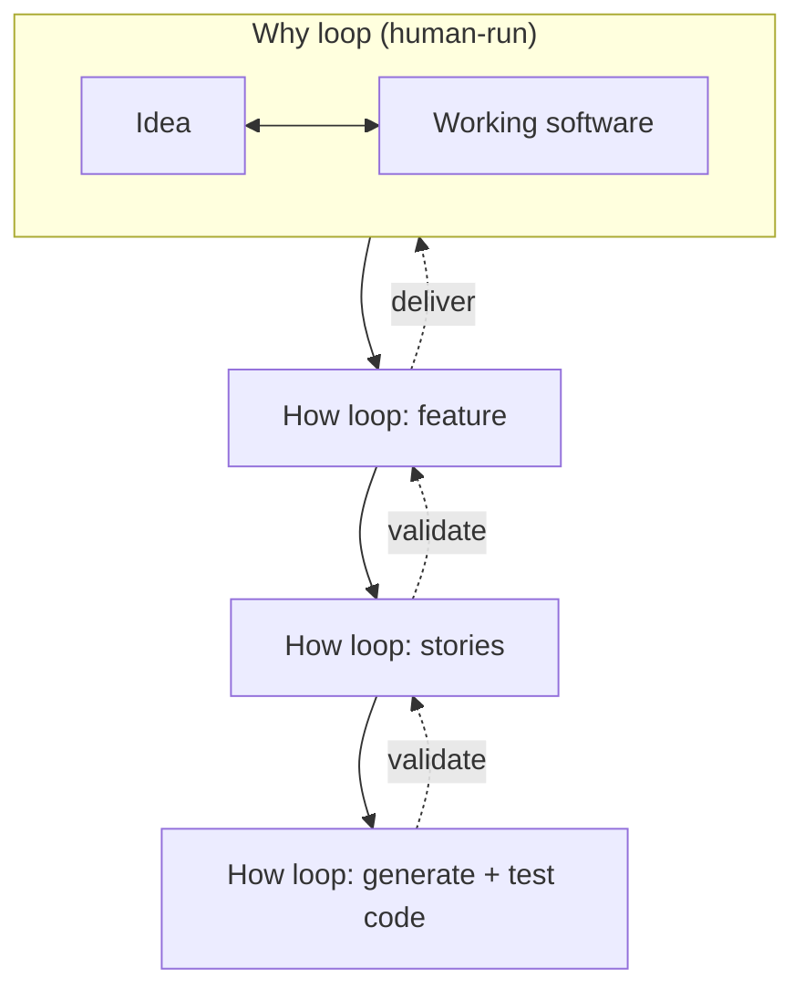

# Humans and Agents in Software Engineering Loops

Kief Morris (Thoughtworks), March 2026, part of Martin Fowler's *Exploring Gen AI* series.
The question it answers: should humans stay out of the development process and vibe-code, or
sit *in* the loop inspecting every line? Morris's answer rejects both extremes. Focus on the
goal — turning ideas into outcomes — and put humans where they have leverage: **building and
managing the working loop** rather than either abandoning the agents or micromanaging their
output. Call that position **"on the loop."**

## The why loop and the how loop

Morris models software delivery as two nested feedback loops:

- The **why loop** iterates over an *idea* and *working software*. Humans run this loop —
  we are the ones who want what it produces.
- The **how loop** is the process of *building* the software: creating, selecting, and using
  intermediate artefacts — code, tests, tools, infrastructure, designs, ADRs. These
  artefacts feel like deliverables but are really just a means to the outcome.

The how loop is not one loop but several nested levels: an outer loop iterates on a
**feature**, a middle loop on **stories**, an inner loop **generates and tests code**. Each
level breaks higher work into smaller tasks for the level below and validates the results.

## In the loop vs on the loop

The distinction is clearest in **what you do when you're not satisfied** with what the agent
produced — including an intermediate artefact:

- **In the loop** — you *fix the artefact*: edit the code yourself, or tell the agent to
  change that specific thing. You are inside the how loop, correcting outputs one at a time.
- **On the loop** — you *fix the process that produces the artefacts*. Rather than
  inspecting every output, you make the agent **better at producing them**: improve the
  specifications, quality checks, and workflow guidance that govern the loops.

That collection of specs, checks, and workflow guidance is the agent's **harness**. Building
and maintaining it — **Harness Engineering** — is *how humans work on the loop*. (Morris
credits Doppler/technology-radar discussions, including Kief Morris raising cybernetics, and
notes GenAI was used to research and polish the piece.) The "on the loop" idea has also been
described as the **"middle loop"** — moving human attention to a higher-level loop than the
coding loop.

## Why it matters

This is the conceptual backbone under the whole harness-engineering movement: the reason to
build a harness is to move humans *up* a loop, from correcting artefacts to shaping the
process that generates them. It generalizes Hightower's specific
[human-in-the-loop approval gate](hightower-human-in-the-loop.md) — you gate where judgment
is required, and everywhere else you improve the loop instead of inspecting its output. It
connects directly to [Harness Engineering](harness-engineering.md),
[harness engineering for coding-agent users](agent-harness-engineering.md), the role shift
in [from coder to orchestrator](../ai-org/from-coder-to-orchestrator.md), and the graduated trust of
the [autonomy ladder](autonomy-ladder.md). Iterating the spec rather than the code is the
same practice as the ["maintaining the spec" loop](../agentic-coding/principles-of-agentic-development.md)
elsewhere in the wiki.

## References

- [Humans and Agents in Software Engineering Loops — Kief Morris, martinfowler.com](https://martinfowler.com/articles/exploring-gen-ai/humans-and-agents.html)
