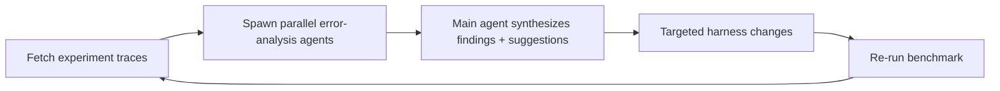

# Improving Deep Agents with Harness Engineering (LangChain)

Vivek Trivedy (LangChain, Feb 2026). A concrete case study: LangChain's coding agent
`deepagents-cli` went from **52.8% → 66.5% on Terminal Bench 2.0 (+13.7 pts), Top 30 → Top 5,
with the model fixed** (`gpt-5.2-codex`). They changed *only the harness*. Empirical proof of
[Lecture 01's](learn-harness-engineering/why-capable-agents-still-fail.md) "same model, different
harness, different fate."

## What harness engineering is for

> The goal of a harness is to mold the inherently spiky intelligence of a model for tasks we
> care about.

Harness engineering is a *systems* problem: build tooling around the model to optimize task
performance, token efficiency, and latency. The purpose of the harness engineer: **prepare and
deliver context so agents can autonomously complete work.** They deliberately compress a huge
design space to **three knobs**: system prompt, tools, and **middleware** (their term for hooks
around model and tool calls).

## The improvement loop: trace analysis as a Skill

Models are black boxes, but their text-space inputs/outputs are visible in **traces** (LangSmith).
The improvement recipe is packaged as an **Agent Skill** — repeatable, mostly automated:

This works like **boosting** — each round focuses on the previous round's mistakes. A human is
useful (not required) at the synthesis step to guard against **overfitting to a task**, which
causes regressions elsewhere. This is [the harness improving
itself](self-improving-harness-loop.md) and the [tracing-as-feedback](hightower-observability.md)
principle made operational.

## What actually improved performance

**Build & self-verify.** The most common failure: the agent writes a solution, re-reads its own
code, decides it looks fine, and stops. Models are strong self-improvers but don't *naturally*
enter a build-verify loop. Fix = system-prompt guidance for a four-phase cycle, plus a hook:

| Phase | What |
|---|---|
| Plan & Discover | read task, scan codebase, plan *and* decide how to verify |
| Build | implement with verification in mind; write tests (happy + edge paths) |
| Verify | run tests, read **full** output, compare against the **spec** — not against your own code |
| Fix | analyze errors, revisit the original spec, fix |

A **`PreCompletionChecklistMiddleware`** intercepts the agent before it exits and forces a
verification pass against the task spec — explicitly a [Ralph Wiggum
loop](ralph-wiggum-software-engineer.md) (a hook that refuses the exit and pushes the agent to
keep executing), used here for verification. Echoes [Lecture 09/10](learn-harness-engineering/declaring-victory-too-early.md):
replace the agent's *feelings* with execution-based checks.

**Give agents environment context.** Context assembly is hard for agents in unseen environments,
so inject it deterministically rather than hoping the agent discovers it:

- **`LocalContextMiddleware`** — on start, maps the cwd + parent/child dirs and runs bash to find
  tooling (e.g. Python installs). Injecting context shrinks the error surface of flaky search.
- **Testable-code prompting** — tell the agent its work is graded by programmatic tests: follow
  file paths in the spec *exactly*, stress edge cases not just the happy path. Prevents "slop
  buildup."
- **Time budgeting** — inject time-budget warnings to nudge finishing + verification (agents are
  famously bad at time estimation).

**Break doom loops.** Agents get myopic and make 10+ tiny variations on the same broken approach.
A **`LoopDetectionMiddleware`** tracks per-file edit counts via tool hooks and injects "consider
reconsidering your approach" after N edits to one file.

**Spend reasoning compute where it pays.** `gpt-5.2-codex` has 4 reasoning modes
(low/medium/high/xhigh). Terminal Bench timeouts create a tradeoff — more reasoning catches
mistakes but burns >2× tokens/time and causes timeouts. Their heuristic: a **"reasoning
sandwich" — xhigh on planning, high in the middle, xhigh on verification.**

| Setting | Score |
|---|---|
| xhigh everywhere | 53.9% (timeouts) |
| high everywhere | 63.6% |
| xhigh–high–xhigh sandwich | **66.5%** |

## Takeaways

- **Context-engineer on behalf of the agent** — onboard it with dir structure, tools, and
  problem-solving strategy. See [Context Engineering](context-engineering.md).
- **Force self-verification** — models bias toward their first plausible solution; prompt
  aggressively to run tests and refine, especially without a human in the loop.
- **Tracing is the feedback signal** — debug tooling *and* reasoning together (wrong paths often
  mean a missing tool or instruction).
- **Design around today's model flaws** (blind retries, skipped verification) while planning for
  smarter models — these guardrails will dissolve over time.
- **Tailor the harness to the model** — Claude Opus 4.6 scored 59.6% on an earlier harness not
  tuned for it; Codex and Claude need different prompting. Many principles generalize, but run a
  few iteration rounds per model.

Open directions: multi-model harnesses (Codex + Gemini + Claude), memory primitives for continual
learning, and RLMs to mine traces more efficiently. `deepagents` is open source (Python + JS).

Related hub notes: [Harness Engineering (Sensors & Simulators)](harness-engineering.md),
[Automated Review & Verification](automated-review-verification.md), [AI Coding
Sensors](ai-coding-sensors.md), [Engineer the Loop, Not the Prompt](engineer-the-loop.md).

## References
- [Improving Deep Agents with harness engineering](https://www.langchain.com/blog/improving-deep-agents-with-harness-engineering)
