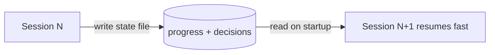

# Lecture 05: Keeping Context Alive Across Sessions

Claude Code runs 30 minutes, does most of the work, context runs low. You start a new session
to continue — and it doesn't remember which decisions were made, *why* A was chosen over B,
which files changed, or the state of the tests. It burns 15 minutes re-exploring and may take a
different approach than last time.

## Windows are finite — and no upgrade fixes it

Even at 1M tokens, complex tasks exhaust the window: agents aren't just generating code, they're
understanding codebases, tracking decision history, processing tool output, and holding
conversation. That grows faster than window size.

**The deeper problem is that the information isn't uniformly important.** Intermediate reasoning
holds the *why* (why A over B, why this library, why an optimization was skipped). The final
output holds only the *what* (the code). Compaction usually keeps the *what* and loses the
*why* — so the next session sees the code but may "optimize away" a deliberate design decision.

## Context anxiety

Anthropic observed a **"rushed finish"** behavior: when an agent senses context running low, it
rushes current work, skips verification, or picks a simple solution over the optimal one. They
call it *context anxiety.*

## State-persistence files

The fix is externalized, repo-resident **state files** that let a new session unambiguously
resume: what was decided and why, what's done, what's in progress, current test state.

Related: [Memory Engineering](../memory-engineering.md), [Context Assembly
(Hightower)](../hightower-context-assembly.md), [Managing Context on the Claude
Platform](../claude-context-management.md), and Lecture
[12: Clean handoff](clean-state-every-session.md) (what the file must contain at exit).

## References
- [Lecture 05: Why Long-Running Tasks Lose Continuity](https://walkinglabs.github.io/learn-harness-engineering/en/lectures/lecture-05-why-long-running-tasks-lose-continuity/)
