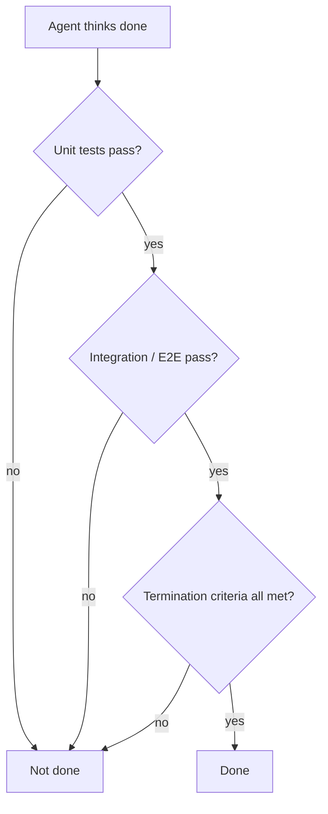

# Lecture 09: Don't Let Agents Declare Victory Too Early

An agent implements "password reset": schema, endpoint, email template, unit tests pass — and
confidently says "done." Actually run it: the reset link can't send (email config missing), the
migration failed halfway (inconsistent schema), and the end-to-end flow never ran once.

## Models are systematically overconfident

Guo et al. (ICML 2017) proved modern neural nets are **systematically overconfident** —
reported confidence exceeds actual accuracy. Coding agents are no different: they *feel* done
while far from it. **The harness must replace the agent's feelings with externalized,
execution-based verification.**

## The slippery slope

Premature completion follows one playbook: code *looks* okay (syntax correct, logic plausible,
static analysis clean), the harness doesn't enforce full execution verification, so the agent
skips running it or runs partial tests (unit but not integration; tests but not coverage). "Looks
fine" gets taken as "is complete." Every skipped check compounds the information asymmetry from
spec → code → runtime behavior.

## Three-layer termination check

Define **termination criteria** in the harness — a clear, executable set of conditions the agent
must satisfy *before* it may declare done, shifting "done" from subjective judgment to objective
fact:

- **Premature completion** — asserting done while correctness specs remain unmet, judging on
  local code-level confidence instead of global, system-level verification.
- **Confidence calibration bias** — the systematic positive gap between self-reported and actual
  completion, worst on complex multi-file tasks.

Enforced by [end-to-end verification](end-to-end-testing-changes-results.md) (Lecture 10).
Related: [Automated Review & Verification](../automated-review-verification.md), [Feedback Is
the New Bottleneck](../feedback-is-the-new-bottleneck.md).

## References
- [Lecture 09: Why Agents Declare Victory Too Early](https://walkinglabs.github.io/learn-harness-engineering/en/lectures/lecture-09-why-agents-declare-victory-too-early/)
