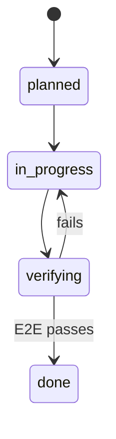

# Lecture 08: Feature Lists Are Harness Primitives

You ask for an e-commerce site. The agent says "done." Auth works, but the cart's checkout
button does nothing and payments aren't wired at all. You never told it what "done" means, so it
used its own standard: *"I wrote a lot of code and it looks fairly complete."*

## Not a memo — a foundational data structure

Most people treat a feature list as a human memo. In the harness world it's **the structure the
whole harness is built on**: the scheduler reads it to pick tasks, the verifier reads it to
judge completion, the handoff reporter reads it to generate summaries. Without it, these
components have no shared consensus. Both Anthropic and OpenAI stress: **feature state must be
externalized into a machine-readable file in the repo, not left in conversation text.**

## Agents don't know what "done" means

"Add a shopping cart" might mean "write a Cart component + addToCart" to the model, but you meant
"browse → add → checkout, end-to-end." That gap persists without a list; the agent falls back to
"no obvious syntax errors." What's needed is **end-to-end behavioral verification** tied to each
listed feature.

Compare a vague progress note — *"did user auth, cart mostly done, still need payments"* — no new
session can answer *what does "mostly done" mean, which tests passed, what blocks payments.*
Anthropic: good progress records cut session-startup diagnosis by **60–80%.**

## Feature state machine

Each feature carries explicit status and acceptance criteria, so "done" is objective and shared.
Related: [Self-Improving Harness Loop](../self-improving-harness-loop.md), and Lecture
[09: Declaring victory too early](declaring-victory-too-early.md).

## References
- [Lecture 08: Why Feature Lists Are Harness Primitives](https://walkinglabs.github.io/learn-harness-engineering/en/lectures/lecture-08-why-feature-lists-are-harness-primitives/)
