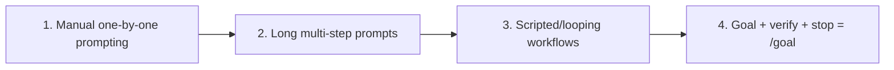

# Lecture 13: From Manual Prompting to Autonomous Loops

Everything in Lectures 1–12 assumed **you** at the keyboard, typing instructions one at a time.
You wrote AGENTS.md (1–4), built state management (5–6), constrained scope with feature lists
(7–8), left clean handoffs (9, 12), made the runtime observable (10–11) — but the *trigger* was
always you. The agent never decided when to start; no one pressed "start." This lecture hands
the start button to the system. **Not giving up control — elevating it to the next layer.**

## `/goal`: the simplest possible loop

The entrance to loop engineering isn't an architecture diagram — it's one command. In early
2026, Claude Code and OpenAI Codex independently shipped the same feature: `/goal`.

```
/goal "All tests pass, zero lint warnings, merge to main"
```

Close the laptop, sleep. Eight hours later the agent has analyzed, coded, tested, fixed, and
merged on its own — retrying on failure, switching approaches when stuck, stopping when done.

| | Traditional prompt | `/goal` |
|---|---|---|
| You provide | what to do next | what the end state looks like |
| Agent does | execute once | loop until achieved |
| Who judges done | you | a verifiable stopping condition |
| Walk away | can't | the moment you type it |

**`/goal` is a loop with exactly three parts: a goal, a verification method, and a stopping
condition.** Those three move you from *inside* the loop to *outside* it.

## How `/goal` grew organically



- **Stage 1** — back-and-forth, one step at a time; you are the scheduler.
- **Stage 2** — longer prompts stacking steps; the agent runs several in a row but you still wait.
- **Stage 3** — workflows loop the steps automatically.
- **Stage 4** — state the goal, verification, and stop condition; the system schedules itself.

This is [loop engineering](../loop-engineering.md): you engineer the loop, not the prompt.
Related: [Engineer the Loop, Not the Prompt](../engineer-the-loop.md), [Everything Is a Ralph
Loop](../everything-is-a-ralph-loop.md), [Ralph Wiggum as a Software
Engineer](../ralph-wiggum-software-engineer.md), [Loop Engineering: The Anthropic
Playbook](../loop-engineering-playbook.md).

## References
- [Lecture 13: From Manual Prompting to Autonomous Loops](https://walkinglabs.github.io/learn-harness-engineering/en/lectures/lecture-13-loop-engineering/)
