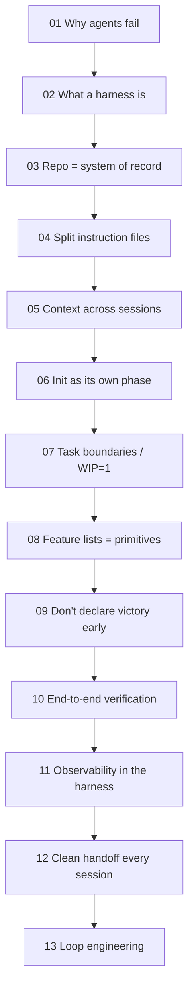

# Learn Harness Engineering (WalkingLabs Course)

A free, open-source course (WalkingLabs, `walkinglabs.github.io/learn-harness-engineering`)
that builds a coding-agent harness from nothing across **13 lectures**, each paired with a
hands-on practice project. The spine of the argument: *strong models don't mean reliable
execution* — the engineering scaffolding around the model (the harness) is what turns a
capable agent into a reliable one. Anchored throughout in OpenAI's and Anthropic's harness
writing (["the repo IS the spec"](../harness-engineering-openai-codex.md), [effective
harnesses for long-running agents](../effective-context-engineering-anthropic.md)).

The lectures move from *why agents fail* → *what a harness is* → the concrete subsystems
(instructions, state, scope, verification, observability, hygiene) → *loop engineering*, the
layer that hands the start button to the system. It's the applied companion to the concept
notes already in this [Harness Engineering hub](../index.md).

## The arc

## Lectures

- [Lecture 01: Why Capable Agents Still Fail](why-capable-agents-still-fail.md) — same model, no harness vs full harness: unreliable → reliable is a qualitative leap
- [Lecture 02: What a Harness Actually Is](what-a-harness-actually-is.md) — five subsystems: instructions, tools, environment, state, feedback
- [Lecture 03: The Repository as Single Source of Truth](repository-as-system-of-record.md) — info not in the repo doesn't exist for the agent; the fresh-session test
- [Lecture 04: Split Instructions Across Files](split-instructions-across-files.md) — the giant-instruction-file trap; lost-in-the-middle; load rules on demand
- [Lecture 05: Keeping Context Alive Across Sessions](context-across-sessions.md) — windows are finite; state-persistence files carry the "why," not just the "what"
- [Lecture 06: Initialization as Its Own Phase](initialization-as-its-own-phase.md) — init and implementation are different jobs; don't mix them
- [Lecture 07: Draw Clear Task Boundaries](task-boundaries-and-overreach.md) — overreach is math (C/k); WIP=1 lifts completion ~37%
- [Lecture 08: Feature Lists Are Harness Primitives](feature-lists-as-harness-primitives.md) — machine-readable feature state the scheduler/verifier/handoff all read
- [Lecture 09: Don't Let Agents Declare Victory Too Early](declaring-victory-too-early.md) — models are systematically overconfident; replace feelings with execution checks
- [Lecture 10: Only a Full Pipeline Run Counts](end-to-end-testing-changes-results.md) — unit tests miss integration defects; E2E changes agent behavior too
- [Lecture 11: Make the Runtime Observable](observability-inside-the-harness.md) — without traces, decisions/evals/retries are guesses
- [Lecture 12: Leave a Clean Handoff Every Session](clean-state-every-session.md) — entropy is the default; encode golden rules, periodic cleanup
- [Lecture 13: From Manual Prompting to Autonomous Loops](from-manual-prompting-to-autonomous-loops.md) — `/goal` = goal + verification + stop condition; step outside the loop

## Practice projects

Each lecture pairs with a checked-in, code-along exercise (build one Electron knowledge-base app,
add one harness mechanism per project). See the [Projects catalog](projects/index.md).

## References
- [Learn Harness Engineering](https://walkinglabs.github.io/learn-harness-engineering/en/)
