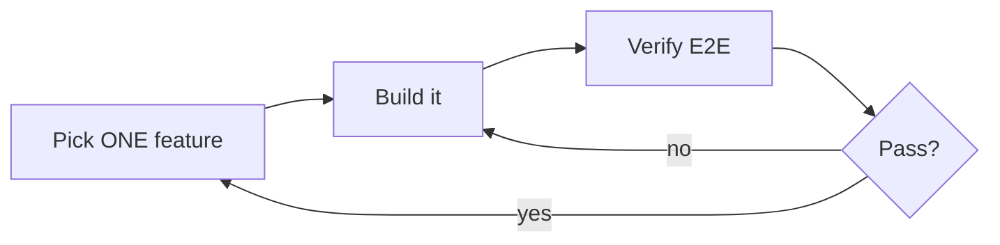

# Lecture 07: Draw Clear Task Boundaries (Overreach and WIP=1)

You say "add user authentication." The agent modifies the schema, writes routes, changes
frontend components, and — while it's at it — refactors the error-handling middleware. Two hours
later: 12 files, 800 new lines, and not one feature works end-to-end. Agents are born with an
impulse to *do a little extra*, and doing too many things at once almost guarantees none get
done well.

Anthropic: broad prompts make agents "start multiple things at once" instead of finishing one.
OpenAI's Codex practice found the same — tasks without explicit scope control see completion
rates plummet. **This is a harness problem: you didn't draw the boundary.**

## Attention is finite — it's math

With context capacity `C` and `k` tasks activated at once, each task gets ~`C/k` reasoning
resources. When `C/k` drops below the minimum needed to finish a single task, **none** finish.
An agent asked to "add user registration" fans out to a User model, the route, email
verification, bcrypt, refactoring global error handling, reorganizing test dirs — six half-done
things, no E2E verification, and the next session inherits the mess.

## WIP=1

Anthropic's data: a **"small next step" strategy (WIP=1)** shows **~37% higher completion** than
broad prompts. More striking, **lines of code generated is weakly *negatively* correlated with
features completed** — more code, fewer features done.

Constrain to one verified feature at a time. The mechanism for *what* the one feature is comes
next: [feature lists](feature-lists-as-harness-primitives.md). Related: [The Autonomy
Ladder](../autonomy-ladder.md).

## References
- [Lecture 07: Why Agents Overreach and Under-Finish](https://walkinglabs.github.io/learn-harness-engineering/en/lectures/lecture-07-why-agents-overreach-and-under-finish/)
