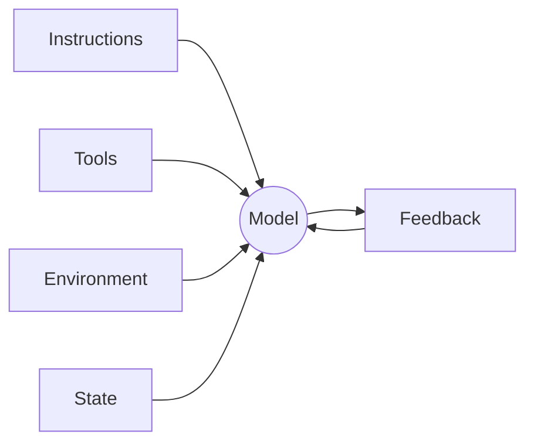

# Lecture 02: What a Harness Actually Is

Most people say "harness" but mean *a prompt file*. A prompt file is not a harness. This
lecture gives a precise, actionable definition: **a harness is five subsystems, each with clear
responsibilities and evaluation criteria.**

## The five subsystems

- **Instructions** — what to do and the rules to follow (CLAUDE.md, `.cursorrules`, AGENTS.md).
- **Tools** — what the agent can *do*: run shell, edit files, execute tests.
- **Environment** — where it runs: local shell, isolated git worktree, containers.
- **State** — what persists across steps and sessions: history, progress files.
- **Feedback** — how it learns whether it succeeded: test output, traces, evaluators.

## The core principle

OpenAI frames it as **"the repo IS the spec"** — all necessary context lives in the
repository, delivered through structured instruction files, explicit verification commands, and
clear directory organization. Anthropic's long-running-agents work stresses state persistence,
explicit recovery paths, and structured progress tracking. Different emphases, same claim:
**everything outside the model determines how much of the model's capability is realized.**

## Tools mapped to the definition

- **Claude Code** — reads CLAUDE.md, runs shell, executes locally, keeps session history, runs
  tests. But if you never tell it how to test, its *feedback* subsystem is empty.
- **Cursor** — `.cursorrules` = instructions, terminal = tools; but *state* is weak (close the
  IDE and context is gone).
- **Codex** — git worktrees isolate each task's *environment*, with a local observability stack
  (logs/metrics/traces) feeding *feedback*.

The gaps are diagnosable subsystem-by-subsystem. Related: [What Is Harness Engineering?
(Hightower)](../hightower-what-is-harness-engineering.md), [Harness Engineering (Sensors &
Simulators)](../harness-engineering.md), [AI Harness Architecture](../ai-harness-architecture.md),
[The Naked Agent](../hightower-the-naked-agent.md).

## References
- [Lecture 02: What a Harness Actually Is](https://walkinglabs.github.io/learn-harness-engineering/en/lectures/lecture-02-what-a-harness-actually-is/)
