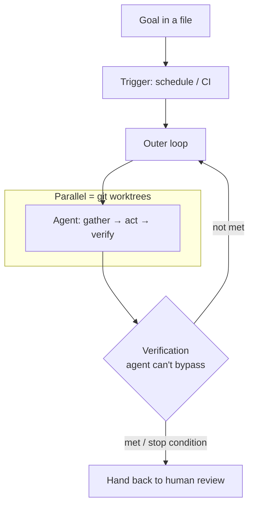

# Loop Engineering (Addy Osmani)

Addy Osmani's take on **loop engineering**: the job is no longer prompting the agent,
it's building the *loop* that prompts the agent. He quotes Boris Cherny (creator of
Claude Code): "I don't prompt Claude anymore. I have loops that are running. They're
the ones prompting Claude and figuring out what to do. My job is to write loops."

Loop engineering sits on top of [harness engineering](harness-engineering.md) and
[context engineering](context-engineering.md): a good harness makes a single agent run
well and good context keeps the right tokens in front of it; loop engineering wraps an
**outer, goal-seeking loop** around the agent's built-in **inner cycle** (gather
context → act → verify → repeat) and iterates toward a goal after you walk away. See
the general [loop engineering](loop-engineering.md) note for the pattern; this note is
Osmani's specific treatment.

## What a production loop needs

- A **goal** written into files that outlive the session.
- A **trigger** other than a keystroke — a schedule, a CI event.
- **Fresh context** on each iteration.
- **Verification** the agent cannot bypass.
- A defined **stop condition** for handing back to a human.

The canonical minimal example is Geoffrey Huntley's "Ralph": `while :; do cat
PROMPT.md | claude-code; done` — the goal in a file, looped. It's "deterministically
bad in an undeterministic world"; it works on *eventual consistency* and on *tuning
the loop* when it drifts, not on any single run being right. The loop, not the prompt,
is what you engineer.

## Worktrees so parallel doesn't turn into chaos

The moment you run more than one agent, files collide — two agents writing the same
file is the same headache as two engineers committing to the same lines without
talking. A **git worktree** fixes it: a separate working directory on its own branch,
sharing the repo history, so one agent's edits literally cannot touch another's
checkout.

- **Codex** builds worktree support in, so several threads hit the same repo without
  bumping into each other.
- **Claude Code** gives the same isolation via `git worktree`, a `--worktree` flag to
  open a session in its own checkout, and an `isolation: worktree` setting on a
  subagent so each helper gets a fresh, self-cleaning checkout.

Worktrees remove the *mechanical* collision — but **you are still the ceiling**. Your
**review bandwidth**, not the tool, decides how many loops you can actually run. This
is the orchestration end of the work (see
[from coder to orchestrator](../ai-org/from-coder-to-orchestrator.md)): the failure mode is
orchestrating work you no longer understand.

## Related

- [Loop Engineering](loop-engineering.md) — the general pattern (Tessl).
- [Harness Engineering](harness-engineering.md) — the layer loop engineering sits on.
- [Context Engineering](context-engineering.md) — fresh context per iteration.
- [From Coder to Orchestrator](../ai-org/from-coder-to-orchestrator.md) — the orchestration end, and review as the ceiling.

## References
- [Loop Engineering — Addy Osmani](https://addyo.substack.com/p/loop-engineering)
