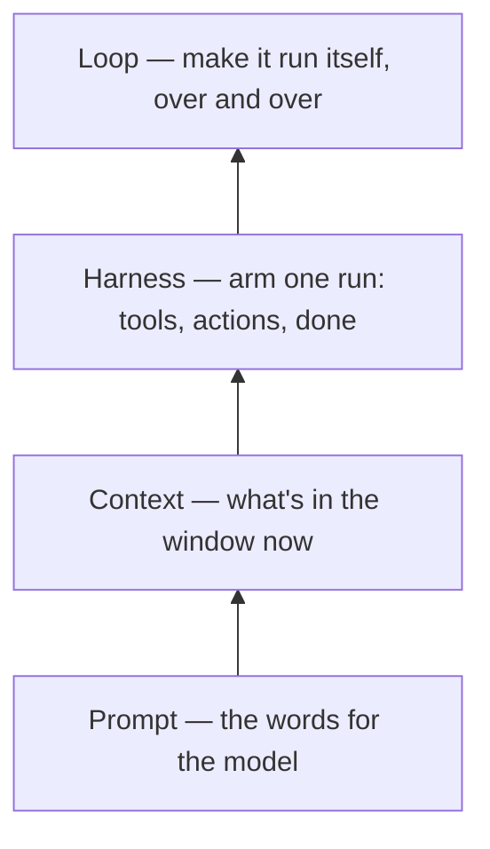

# Loop Engineering: The Anthropic Playbook

A field-study working note (conference-style reformatting of HuaShu's "Orange Book",
building on Addy Osmani's framework) defining **loop engineering** — the fourth "XX
Engineering" layer, surfaced June 2026 by Steinberger, Cherny, and Osmani.

**Definition:** replace *yourself* as the one who prompts the agent; design the system
that prompts it instead. You move from inside the loop to outside, building it.

## The four-layer stack

Prompt (the words for the model) → Context (what's in the window now) → Harness (arm a
single run: tools, actions, "done") → **Loop** (make it run itself over and over). Each
layer's unit of concern grows: sentence → window → run → self-running loop. Key intuition:
**a mistake's cost scales with how many turns it survives before someone catches it, and a
loop is a machine for maximizing turns** — hence every safety mechanism exists to shorten
the distance between a mistake and its discovery.

## Five moves of one turn

Discovery (find the work itself, via a skill) → Handoff (isolate each task in a worktree)
→ **Verification** (a separate agent that says "no") → Persistence (write state to disk)
→ Scheduling (make it recur). Six parts realize them: automations, worktrees, skills,
connectors (MCP), sub-agents, memory.

## Generator vs. evaluator (the hardest part)

An agent grading its own work praises it — it sees its chain of self-persuasion, not the
result. Fix is **structural, not wording**: swap in a separate evaluator with different
instructions (and ideally a different model), default it to doubt ("assume broken until
proven"), make it **act, not just read** (e.g. Playwright MCP — click, screenshot, run
tests), and hand the final say to a fresh model. Claude Code's `/goal` encodes this: run
until a condition holds, judged each turn by a small fresh model — the maker-checker
principle from banking. (Don't confuse `/goal` with `/loop`, which merely reruns on an
interval.)

## Five ways a loop goes wrong (one per skipped move)

Nodding loop (no verification — most common), Amnesiac loop (no persistence), Manual loop
(no scheduling), Blind loop (no discovery), Tangled loop (no handoff → parallel agents
collide).

## Three real loops

Osmani's morning triage (one engineer); **Stripe's Minions** — 1,300+ machine-written
PRs/week, a Goose fork whose reliability comes from *deterministic gates around the LLM*,
not model size (anything rule-bound is kept out of the probabilistic model); the takeaway
that "running while you sleep" needs cloud/CI scheduling (machine-off), not just local
`/loop`.

## Four silent costs

Verification debt, comprehension rot, cognitive surrender, token blowout — they reinforce
each other and come due at once. Guards: independent evaluator, read a daily sample,
hard budget caps, one human-review checkpoint.

**The through-line:** loops make generation nearly free and leave *judgment* as the scarce
resource; a loop is a faithful multiplier of its builder, so the same loop built by two
people yields opposite outcomes. "Build the loop, but build it like someone who intends
to stay the engineer, not just the one who presses go."

## The four-layer stack

## Cross-links

The long-form authority behind the [Engineer the Loop, Not the Prompt](engineer-the-loop.md)
infographic and [The Autonomy Ladder](autonomy-ladder.md). It sits one floor above
[Agent Harness Engineering](agent-harness-engineering.md); the generator/evaluator split
is that note's verification layer; the failure list parallels
[Six Friction Clusters](agent-harness-friction-clusters.md). Uses the patterns in
[Agent Patterns Quick Reference](../agentic-coding/agent-patterns-quick-reference.md) and connectors from
[MCP Configuration Reference](../ai-platform/mcp-configuration-reference.md). See also the shorter
Tessl framing in [Loop Engineering](loop-engineering.md) (five loop ingredients + Ralph).

## References

- Addy Osmani, "Loop Engineering" (blog / Substack, Jun 2026); this note synthesizes an independent reformatting of HuaShu's open "Orange Book" guide, [freely available at huasheng.ai/orange-books](https://huasheng.ai/orange-books).
