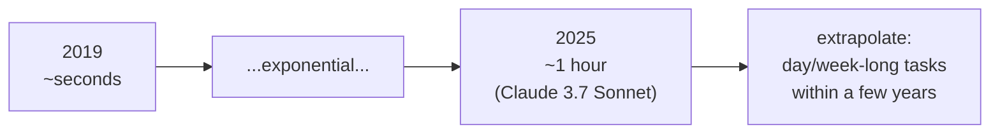

# Measuring AI Ability to Complete Long Tasks (METR)

METR's study (Mar 2025) proposing a new way to measure model capability: not
benchmark accuracy but the **length of task** a model can complete
autonomously. It's the empirical backbone for the "autonomy is trending up"
claim across [loop engineering](loop-engineering.md),
[the software-factory essay](loop-engineering-software-factory.md), and
[the autonomy ladder](autonomy-ladder.md). A key entry in
[public benchmarks](../ai-platform/public-benchmarks.md).

## The metric: task-completion time horizon

For each model, take a diverse set of multi-step software/reasoning tasks, record
how long **human experts** take on each, then find the human-task-length at which
the model succeeds with **50% probability**. That length is the model's *time
horizon*.

- Current models have ~100% success on tasks that take humans **under 4 minutes**,
  but under 10% success on tasks taking **more than ~4 hours**.
- Claude 3.7 Sonnet's 50% time horizon is roughly **one hour**.

This resolves an apparent paradox: models crush exam-style benchmarks yet fail to
robustly automate day-to-day work. They're strong on single steps; they struggle
to **string many steps together** coherently — which is exactly what long tasks
require.

## The trend: doubling every ~7 months

Over the last **6 years** the 50% time horizon has grown **exponentially, with a
doubling time of ~7 months** (roughly 1–4 doublings per year). The trend is
robust: it holds across task subsets and on a separate SWE-bench Verified dataset
(where doubling is even faster — under 3 months). Even if the absolute
measurements were off by 10×, that shifts the forecast by only ~2 years.

Extrapolated, generalist autonomous agents capable of a wide range of **week-long
tasks** arrive within a few years — the capability curve that makes
[loop engineering](loop-engineering.md) and the [dark factory](dark-factory.md)
economically real, and that Ben Stein felt firsthand when models
[silently got smarter under his product](../ai-platform/shipping-products-you-dont-know.md).

METR maintains an updated "Time Horizon 1.1" measurement over a larger task suite;
the original paper is on [arXiv](https://arxiv.org/abs/2503.14499).

## References
- [Measuring AI Ability to Complete Long Tasks — METR](https://metr.org/blog/2025-03-19-measuring-ai-ability-to-complete-long-tasks/)
