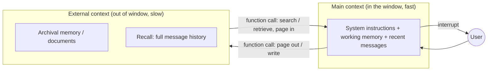

# MemGPT

A system from Charles Packer, Sarah Wooders, Kevin Lin, Vivian Fang, Shishir Patil, Ion Stoica, and Joseph Gonzalez (UC Berkeley; later commercialized as Letta, 2023) that treats the LLM context window as a scarce resource to be *managed* the way an operating system manages RAM. The problem it attacks: a fixed context window caps what a model can attend to, crippling extended conversations and analysis of documents larger than the window.

## The idea: virtual context management

MemGPT borrows the hierarchical-memory trick from operating systems — giving the appearance of large memory by paging data between fast and slow tiers.

- **Main context** is what fits in the window right now — the fast tier.
- **External context** (archival storage, full recall history, uploaded documents) is the slow tier, far larger than the window.
- The LLM itself moves data between tiers via **function calls**, deciding what to page in and out.
- **Interrupts** manage control flow between the model and the user, letting MemGPT run multi-step memory operations before yielding a reply.

The model, in effect, is the OS scheduler for its own memory.

## Where it was evaluated

Two settings where a small window hurts most: **document analysis** (MemGPT analyzes documents that far exceed the underlying model's context) and **multi-session chat** (agents that remember, reflect, and evolve across long-term interactions with a user). Code and data: [research.memgpt.ai](https://research.memgpt.ai).

## Why it matters here

MemGPT is a landmark in the agent-memory lineage HAL tracks. Its self-editing memory-block design is dissected in [agent memory systems and knowledge graphs](agent-memory-systems-knowledge-graphs.md) (as the Letta approach) and sits within the survey of [best AI agent memory (2026)](best-ai-agent-memory-2026.md) and [architecting agent memory](architecting-agent-memory.md). More broadly it is a foundational answer to the resource-management framing in [context engineering](context-engineering.md) and [claude context management](claude-context-management.md): treat the window as memory to be scheduled, not a bucket to overfill.

## References

- [MemGPT: Towards LLMs as Operating Systems (arXiv:2310.08560)](https://arxiv.org/abs/2310.08560)
