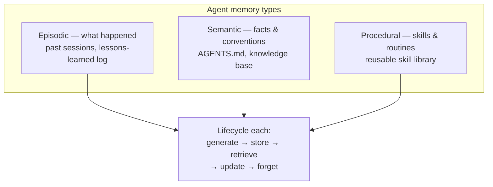

# Memory Engineering

Coding agents are **stateless by default** — every session starts cold, and
whatever the agent learned last time is gone. Memory engineering is the
discipline of building the **durable layer that persists *between* runs**, so an
agent accumulates experience instead of relearning it.

Where [context engineering](context-engineering.md) manages the **live,
ephemeral window**, memory engineering manages **what outlives it** and gets
retrieved back in. (This is the constraint [loop engineering](loop-engineering.md)
keeps hitting: the window is a *cache that resets, not a memory* — anything that
must survive lives outside the model.)

## Structure borrowed from human memory

- **Episodic** — what happened: past sessions, a lessons-learned log.
- **Semantic** — facts and conventions: an `AGENTS.md` (see
  [four-files workflow](../agentic-coding/four-files-ai-workflow.md)), a knowledge base.
- **Procedural** — skills and routines: a reusable skill library.

Each has its own lifecycle: **generate → store → retrieve → update → forget**.

## Why it matters

Memory turns a *fast* agent into one that *improves*. **Voyager** made the case:
an agent that kept every learned skill as executable code discovered **3.3× more**,
hit milestones up to **15.3× faster**, and carried its skills into a new world
where baseline agents started from zero. (The accumulation engine behind the
[self-improving harness loop](self-improving-harness-loop.md).)

## Where memory lives: three stages

- **RAG first.** Chunk code, embed, retrieve nearest vectors. **Backfired for
  code** — "when you chunk code for embeddings, you're literally tearing apart
  its logic," and a codebase that changes every commit sends the index stale,
  forcing constant re-embedding. Vector DBs (Milvus & kin) *still* suit
  long-term **semantic** recall at scale — millions of embeddings retrieved by
  meaning.
- **Files won.** Agents read and `grep` files just-in-time; Letta's *Is a
  Filesystem All You Need?* even beat a graph memory on a multi-session recall
  benchmark with plain files. Cost = **rediscovery** — no index, so the agent
  re-explores the same ground each session.
- **Richer memory (the frontier).** Structured stores that do more than recall
  text: **entity extraction** + **relations** in a knowledge graph, **episodic**
  history, and the code's **AST**. Zep's Graphiti builds a temporal graph of
  episodic/entity/semantic nodes; Mem0, Cognee, and Letta each sit at a
  different point on the spectrum.

## Related

- [Context Engineering](context-engineering.md) — the live window; memory is its
  durable counterpart (memory-on-disk is where they meet).
- [Loop Engineering](loop-engineering.md) — state outside the model, across
  iterations.
- [Self-Improving Harness Loop](self-improving-harness-loop.md) — memory is what
  makes the improvement stick.
- [Registries](../ai-platform/registries.md) — where procedural memory (a reusable skill
  library) is published, versioned, and governed.

## References
- [Memory Engineering — Tessl Patterns](https://tessl.io/patterns/agentic-development-workflow/memory-engineering/)
