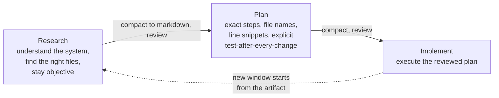

# No Vibes Allowed — Solving Hard Problems in Complex Codebases

Dex Horthy (HumanLayer), building on his viral *12-factor agents* talk, argues
that vibe-coding works for greenfield toy apps but collapses on **brownfield,
complex codebases** — where AI produces a lot of rework and "codebase churn."
Citing a survey of ~100k developers: you ship *more*, but much of it is reworking
the slop you shipped last week — a "tech debt factory." The whole discipline of
**context engineering** exists to get the most out of *today's* models in exactly
these hard cases, rather than waiting for better models.

His team (of three, over eight weeks) rewired how they build software and got
**2–3x more throughput** — enough that they had no choice but to change how they
collaborated. The receipt: a 7-hour Saturday session shipping ~35,000 lines to
BAML — work he estimated at 1–2 weeks by hand.

## From re-steering to intentional compaction

- **Naive use:** ask, then tell it why it's wrong, re-steer, and repeat "until
  you run out of context, give up, or cry."
- **Slightly smarter:** when you're off track, **start a fresh context window**
  with the same task but avoid the dead-end path.
- **Better — intentional compaction:** whether on track or not, ask the agent to
  **compress the current context window into a markdown file.** You review and
  tag it; the *next* agent starts from that summary and gets straight to work
  instead of re-doing all the searching and codebase understanding. Good
  compaction captures **the exact files and line numbers** that matter to the
  problem — not JSON dumps and UUIDs from noisy MCP tools.

This is the operational form of the "frequent intentional compaction" that
underpins [context engineering](context-engineering.md).

## Research → Plan → Implement (RPI)

The workflow people ended up calling **RPI** (a name Dex says he can't shake) has
three phases, each ending in compaction so the window stays small:

- **Research** — understand how the system works, find the right files, stay
  objective. Output: a research doc.
- **Plan** — outline the exact steps, name the files and line snippets, and be
  explicit about how to test after every change.
- **Implement** — execute the reviewed plan.

The prompts for all three are open source on GitHub. Sub-agents help (each returns
a distilled summary), but Dex says the workflow *on top of* sub-agents —
constantly keeping the window small — is what works even better. **Mental
alignment** — the human reviewing the research and plan artifacts before
implementation — is how you keep AI on track and avoid slop.

## The takeaways

- **No silver bullet, no perfect prompt.** The important parts are compaction and
  context engineering — "staying in the smart zone." If you want a hype word, call
  it **harness engineering**: how you integrate with Codex/Claude/Cursor and
  customize your codebase.
- **Coding agents will commoditize.** The hard part becomes adapting your **team,
  workflow, and SDLC** to a world where ~99% of code is AI-shipped.
- **Cultural change must come from the top.** A rift is growing: staff engineers
  resist AI (small speedup for them), juniors lean on it heavily (fills skill
  gaps but produces slop), and seniors resent cleaning up that slop. Leaders
  should pick one tool and get reps.

## Related

- [Context engineering](context-engineering.md) — Dex coined the term; this is the applied playbook.
- [Harness engineering](harness-engineering.md)
- [Loop engineering](loop-engineering.md)
- [Managing context on the Claude Developer Platform](claude-context-management.md) — compaction/editing as a platform primitive.

## References
- [No Vibes Allowed: Solving Hard Problems in Complex Codebases – Dex Horthy, HumanLayer — AI Engineer](https://www.youtube.com/watch?v=rmvDxxNubIg)
