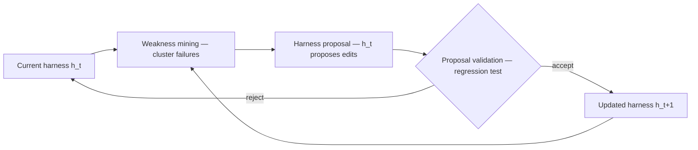

# Self-Improving Harness Loop

A cycle for a harness that improves itself over iterations, indexed by version `h_t`.

1. **Weakness mining** — run the current harness `h_t`, cluster its failure patterns.
2. **Harness proposal** — `h_t` proposes edits to itself.
3. **Proposal validation** — regression test the proposal, then **accept** or **reject**.
   - *Accept* → **updated harness** `h_{t+1}` → next iteration.
   - *Reject* → keep the current harness `h_t`, loop back to weakness mining.

The key guard is the regression test at validation: a proposed self-edit only ships if
it doesn't regress, so the harness can rewrite itself without drifting worse.

## The loop

## Cross-links

An automated version of the improvement loop in
[Engineer the Loop, Not the Prompt](engineer-the-loop.md), operating on the harness
itself; weakness mining targets the problems catalogued in
[Six Friction Clusters When Building Agent Harnesses](agent-harness-friction-clusters.md)
and [Agent Harness Engineering](agent-harness-engineering.md).
