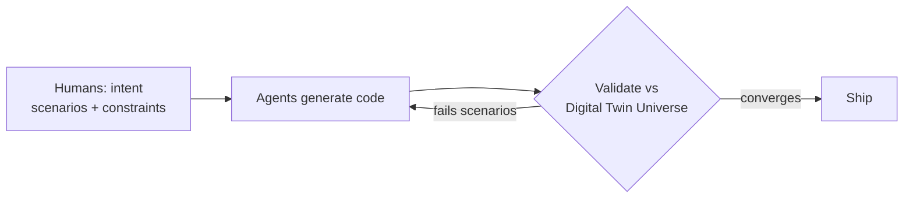

# The StrongDM Software Factory — Building Software with AI

StrongDM's account of the operating model that came out of its AI Lab: a
**Software Factory** in which humans set intent and agents do the building. It's
the clearest public example of a [dark factory](dark-factory.md) — the top rung
of [Dan Shapiro's five levels](five-levels-spicy-autocomplete-to-dark-factory.md).

## The division of labor

**Humans define intent** — what the system should do, the scenarios it must
handle, the constraints that matter. **After that the agents take it from there:**
they generate the code, validate it against real-world behavior, and iterate
**until it converges**.

The charter is deliberately blunt: **"code must not be written by humans"** and
**"code must not be reviewed by humans."** Removing line-by-line human review is
the load-bearing move — so trust has to be engineered in somewhere else.

## Validation replaces code review

Instead of reviewing diffs, agents **prove each change against a "Digital Twin
Universe"** — scenario-based validation against modeled real-world behavior. The
loop runs until the change converges on satisfying the scenarios and constraints,
and *that* is the acceptance gate. Verification, not inspection, is what makes the
output trustworthy.

CTO Justin McCarthy offers a provocative gauge of how far they've pushed it: *"If
you haven't spent at least $1,000 on tokens today per human engineer, your
software factory has room for improvement."*

## Related

- [Dark Factory](dark-factory.md) — the pattern StrongDM instantiates.
- [The Five Levels](five-levels-spicy-autocomplete-to-dark-factory.md) — StrongDM is the Level-5 exemplar.
- [Built by Agents, Tested by Agents, Trusted by Whom?](../ai-governance/built-by-agents-tested-by-agents.md) — the trust/accountability question this raises.
- [AI Factory Stack](../ai-platform/ai-factory-stack.md) — the surrounding architecture.

## References
- [The StrongDM Software Factory: Building Software with AI](https://www.strongdm.com/blog/the-strongdm-software-factory-building-software-with-ai)
