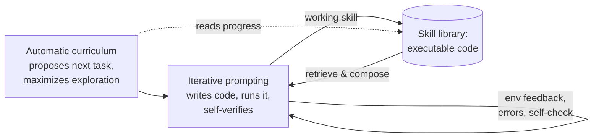

# Voyager — An Open-Ended Embodied Agent with LLMs

Voyager (Wang et al., 2023) is the first LLM-powered **lifelong-learning** agent
in Minecraft: it continuously explores, acquires diverse skills, and makes novel
discoveries **without human intervention** and **without fine-tuning** — it drives
GPT-4 purely through black-box prompting.

## Three components

1. **Automatic curriculum** — proposes the next task to maximize open-ended
   exploration, scaled to the agent's current state.
2. **Ever-growing skill library** — learned behaviors stored as **executable
   code**. Skills are temporally extended, interpretable, and **compositional**,
   so complex ones are built by composing simpler ones. This is the memory that
   makes the agent compound over time.
3. **Iterative prompting mechanism** — incorporates environment feedback,
   execution errors, and self-verification to refine each program until it works,
   then commits it to the library.

## Why it matters for memory

Voyager is the canonical evidence that **memory turns a fast agent into one that
improves**: keeping every learned skill as code let it discover **3.3× more**
unique items, travel distances **2.3× longer**, unlock milestones up to **15.3×
faster** than baselines, and — critically — **carry its skills into a fresh world**
where baseline agents started from zero. Storing skills as executable code (not
weights, not prose) is what makes them portable and composable.

This is the accumulation engine behind the [self-improving harness
loop](self-improving-harness-loop.md) and the "procedural memory" strand of
[memory engineering](memory-engineering.md).

## Related

- [Memory Engineering](memory-engineering.md) — Voyager is its headline case for durable skill memory.
- [Self-Improving Harness Loop](self-improving-harness-loop.md) — memory is what makes the improvement stick.

## References
- [Voyager: An Open-Ended Embodied Agent with Large Language Models — Wang et al., arXiv:2305.16291](https://arxiv.org/abs/2305.16291)
