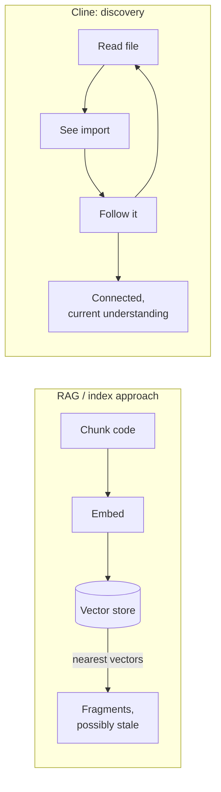

# Why Cline Doesn't Index Your Codebase

Most AI coding tools build a vector index of your repo: chunk the code, embed
the chunks, and retrieve the nearest vectors at query time. Cline deliberately
**doesn't**. Its argument is that RAG-over-code is the wrong tool for the job,
and that reading code the way a developer does is both cheaper and more correct.

## Why RAG breaks down for code

- **Code doesn't think in chunks.** Chunking splits logic that belongs together.
  "When you chunk code for embeddings, you're literally tearing apart its logic."
  A function call lands in chunk 47, its definition in chunk 892, and the context
  that explains *why* it exists is scattered across a dozen more. Natural-language
  text has clean boundaries (paragraphs, sentences); code doesn't, so naive
  chunking severs meaningful units.
- **The index goes stale.** A codebase changes every commit. Any embedding index
  is out of date the moment code is written, forcing constant re-embedding to stay
  current — cost and maintenance with no guarantee the retrieval even surfaces the
  right fragment.
- **A vector store is a second copy** of your source, with its own security surface.

## The alternative: discovery, not retrieval

Cline reads code the way a senior engineer would — **file by file, connection by
connection**. Point it at a React component: it reads the file, sees an import,
follows it; that file imports another, so it follows that too. Each file builds on
the last into a connected understanding. No index, no embeddings — just systematic
exploration that follows the natural structure of the code, and is always current
because it reads the live files.

This is the same conclusion [memory engineering](memory-engineering.md) reaches:
**files won** for code memory — agents read and `grep` just-in-time rather than
querying a stale index. The tradeoff Cline accepts is **rediscovery cost** (no
index means re-exploring each session), which it judges cheaper than the failure
modes of RAG-over-code. Vector databases still earn their place for long-term
*semantic* recall at scale — just not for navigating a live codebase.

## Related

- [Memory Engineering](memory-engineering.md) — the RAG → files → richer-memory arc.
- [Context Engineering](context-engineering.md) — what to load into the live window.

## References
- [Why Cline Doesn't Index Your Codebase (And Why That's a Good Thing)](https://cline.bot/blog/why-cline-doesnt-index-your-codebase-and-why-thats-a-good-thing)
