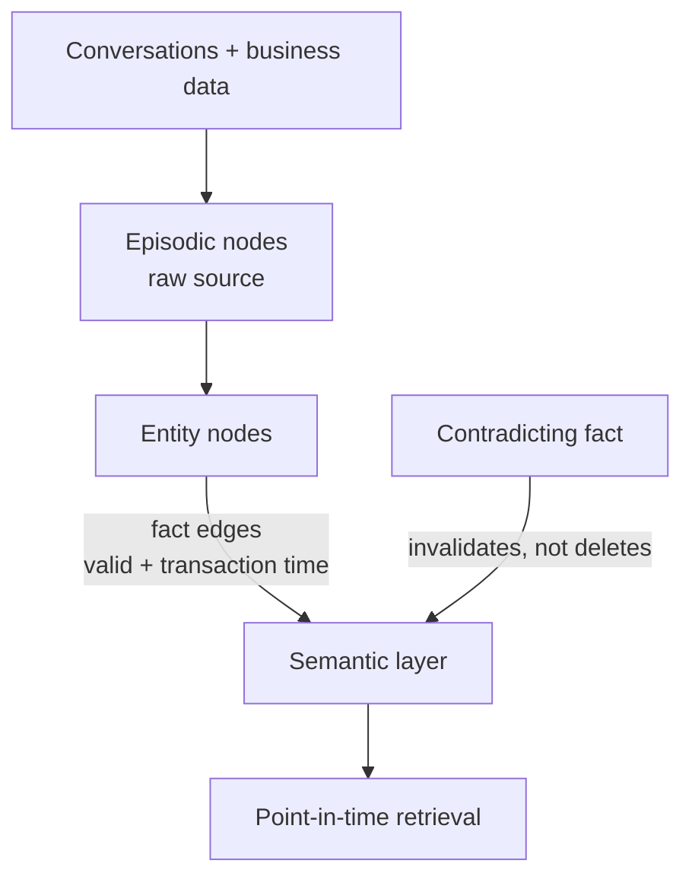

# Zep — A Temporal Knowledge Graph Architecture for Agent Memory

Zep (Rasmussen et al., 2025) is a **memory-layer service** for AI agents. It
outperforms the prior state of the art, **MemGPT**, on the **Deep Memory
Retrieval (DMR)** benchmark, and does better still on harder evaluations that
reflect real enterprise use.

## The gap it closes

Standard RAG frameworks retrieve from **static documents**. Enterprise agents
instead need **dynamic knowledge integration** from ongoing conversations and
changing business data — facts that arrive over time and sometimes contradict
what was believed before. Static retrieval can't represent "this was true then,
that is true now."

## Graphiti — the temporal graph engine

Zep's core component is **Graphiti**, a temporally-aware knowledge-graph engine
that synthesizes both unstructured conversational data and structured business
data into one graph. It composes three node types:

- **Episodic** — the raw input a fact was extracted from.
- **Entity** — entities and their summaries.
- **Semantic** — the facts (relationship edges) between entities.

Each fact edge is **bi-temporal**: it tracks both *valid time* (when the fact was
true in the world) and *transaction time* (when the system learned it). A
contradicting fact **invalidates** the old edge rather than deleting it, so the
graph preserves its own history and supports point-in-time queries.

## Related

- [Memory Engineering](memory-engineering.md) — Graphiti is its "richer memory" frontier example.
- [Agent Memory Systems and Knowledge Graphs](agent-memory-systems-knowledge-graphs.md) — Graphiti's data model at the code level.
- [Best AI Agent Memory 2026](best-ai-agent-memory-2026.md) — where Zep fits among the alternatives.

## References
- [Zep: A Temporal Knowledge Graph Architecture for Agent Memory — Rasmussen et al., arXiv:2501.13956](https://arxiv.org/abs/2501.13956)
