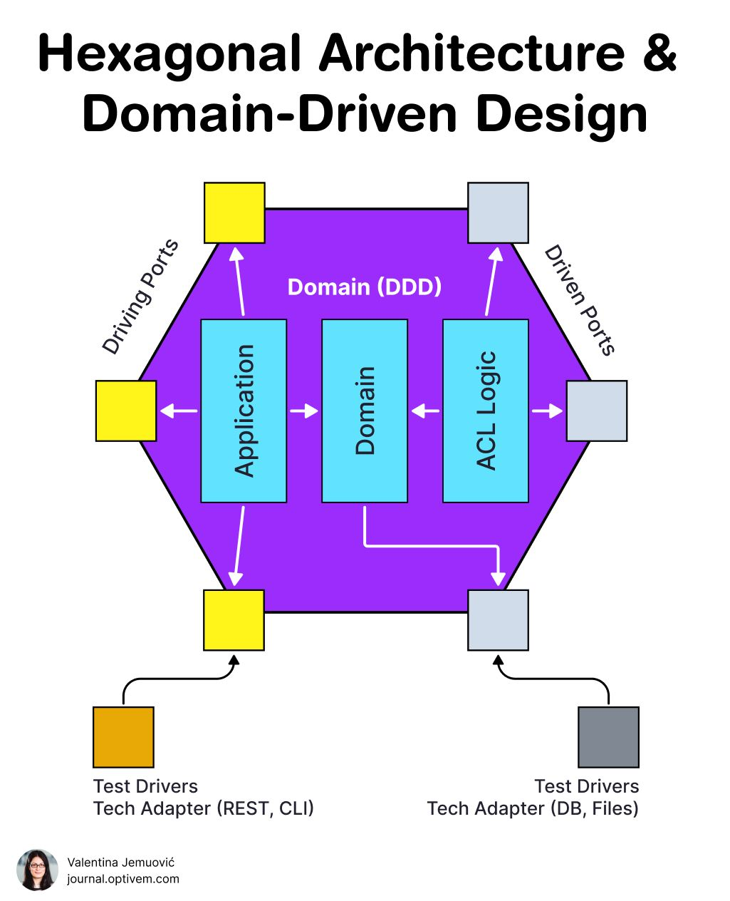

# Hexagonal Architecture & Domain-Driven Design

A diagram (Valentina Jemuović, journal.optivem.com) combining hexagonal (ports &
adapters) architecture with DDD.

## Structure

- The hexagon holds the **Domain (DDD)** core, internally layered as **Application →
  Domain → ACL Logic** (anti-corruption layer).
- **Driving ports** (left) accept input; **driven ports** (right) reach outward.
- Adapters plug into the ports from outside: **tech adapters** for REST/CLI on the
  driving side and DB/Files on the driven side, each exercised by **test drivers**.

The point: the domain depends on ports (abstractions), never on concrete adapters, so
infrastructure can be swapped or stubbed without touching the core.

## Cross-links

Same core as [TDD: Unit Tests and Hexagonal Boundaries](tdd-unit-tests.md) — the test
boundary sits at these ports, which is what makes refactoring safe. Modular architecture
is one of the practices around [TDD](tdd-five-practices.md).

## References

- 
