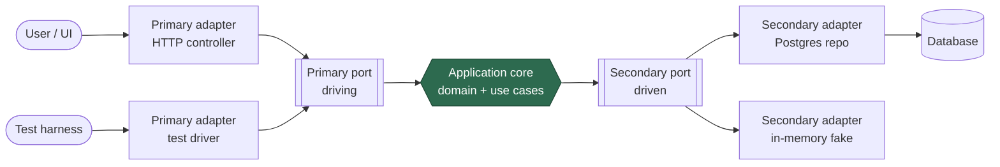

# Hexagonal Architecture (Ports & Adapters)

Hexagonal Architecture, coined by Alistair Cockburn, is really one decision
dressed up as a pattern: **wrap the application core in an API and drive it
through that API from tests, users, and other programs alike.** Everything
else — the ports, the adapters, the six sides — is vocabulary and discipline
built around that single move. The pattern is deliberately under-specified:
Cockburn left the *inside* of the hexagon open, which is why it feels slippery
next to more prescriptive schemes like [Clean Architecture](clean-architecture.md).

## The intent: isolate the core from I/O

The core (the domain logic and the use cases that orchestrate it) should not
know or care *what* is on the outside — whether a request arrives from a web
form, a CLI, a message queue, or a test harness, and whether data is persisted
to Postgres, a file, or an in-memory fake. The core exposes an API and hides
behind one; the outside world plugs into that API. Because the *same* API is
used by real callers and by tests, you can substitute a human, another program,
or an automated test at the boundary with no change to the core. That
substitutability is the whole point.

The governing discipline is a single inviolable rule: **the core never names
anything outside itself.** All dependencies point inward. The core defines the
interfaces; the outside implements them.

## Ports: the conversations the core will hold

A **port** is a purposeful interface — a named conversation the core is willing
to have — expressed entirely in the core's own vocabulary. A port says *what*
the core needs or offers ("for placing an order", "for storing a customer"),
never *how* it is delivered. Ports come in two kinds, and the distinction is
about who initiates the conversation:

- **Primary / driving ports** — the API the core *offers*. Something outside
  (a user, a UI, a test, another service) calls *in* to make the application do
  work. These sit on the left.
- **Secondary / driven ports** — the API the core *requires*. The core calls
  *out* to get something done (persist, send email, fetch a rate). These sit on
  the right. Critically, the core still *defines* these interfaces; it just
  doesn't implement them — this is dependency inversion in action.

## Adapters: technology-specific translators

An **adapter** is the glue that connects a concrete technology to a port. It
translates between the outside world's idiom and the port's idiom:

- A **primary (driving) adapter** turns an external trigger into a call on a
  primary port — e.g. an HTTP controller, a CLI parser, a test driver.
- A **secondary (driven) adapter** implements a secondary port against a real
  technology — e.g. a Postgres repository, an SMTP mailer, an in-memory fake.

Swapping an adapter (real DB for a fake, HTTP for gRPC) leaves the core
untouched, because both sides only ever meet at the port.

## The symmetry of left and right (and its limit)

Drawn as a hexagon, the pattern is visually symmetric: driving adapters →
primary ports on the left, secondary ports → driven adapters on the right, core
in the middle. This symmetry is genuinely useful — it reminds you that *input
and output are both just I/O to be pushed to the edges*, and that a test driver
on the left is no more privileged than the production UI.

But the symmetry has a limit worth naming: the two sides invert control
differently. On the driving side the adapter calls the core. On the driven side
the core calls the port, and the adapter implements it. So while the *shape* is
symmetric, the *dependency direction* is not — both sides depend on the core,
never the reverse.

*Dependencies point inward: adapters depend on ports, ports live in the core.
The core names nothing outside itself.*

## Why six sides? It isn't fundamental

The hexagon shape carries no deep meaning — Cockburn chose it mainly because it
gives room to draw several distinct ports without implying a strict layered
top-to-bottom flow the way a stack of rectangles does. There is no significance
to "six." The essential content is core + ports + adapters + the
inward-dependency rule.

## Testability: the shape the architecture is *for*

Because every external dependency is reached through a port the core defines,
you can drive the core through its primary ports and satisfy its secondary
ports with fast in-memory fakes. This yields fast, deterministic tests of real
use cases with no network, database, or UI in the loop — the application is
"drivable by tests" in exactly the same way it is drivable by users. Cockburn's
original motivation was precisely this: to stop business logic from leaking into
UIs and databases where it could only be tested slowly and awkwardly.

## Contrast with layered architecture

Classic layered architecture stacks UI → business → data access, with each layer
depending on the one below — so the domain ends up depending (transitively) on
the database. Hexagonal breaks that: there is no "below." I/O concerns are
pushed to the *edges* rather than the *bottom*, and the dependency arrow is
inverted so the database is a plug-in detail the core owns the interface to.

Hexagonal is also close kin to [Clean Architecture](clean-architecture.md) and
Onion — Clean's four rings and Onion's inward arrow are essentially prescriptive
ways of filling in the interior Cockburn left open. All three share the
dependency-inversion spine; they differ mostly in how much internal structure
they mandate. Hexagonal is often used to give a
[domain-driven design](domain-driven-design.md) core a clean I/O boundary, and
the two are frequently combined — see
[Hexagonal Architecture with DDD](hexagonal-architecture-ddd.md).

## References

- [Hexagonal Architecture — Alistair Cockburn](https://alistair.cockburn.us/hexagonal-architecture/)
