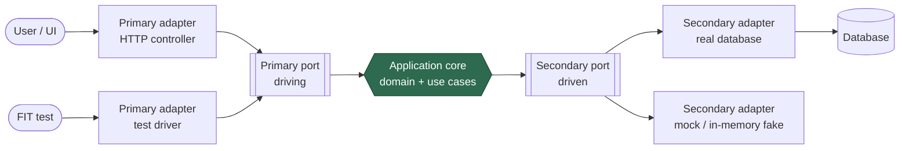

# Hexagonal Architecture (Ports & Adapters)

Alistair Cockburn's essay states its purpose in one sentence:

> Allow an application to equally be driven by users, programs, automated test or batch
> scripts, and to be developed and tested in isolation from its eventual run-time devices
> and databases.

That is **the one problem** the pattern solves. Everything else — ports, adapters, the
six sides — is vocabulary built around that single move: **wrap the application core in
an API and drive it through that API, whether the caller is a person, another program, or
a test.** Cockburn coined the name "hexagonal" to escape the misleading top/bottom
implications of the classic layered "UI over business logic over database" drawing.

## The one problem: leakage in both directions

The essay names the recurring failure it was written to cure: **business logic leaks into
the user interface**, so it can't be tested without the UI, can't be reused by a batch
program, and can't be automated. The symmetric failure is logic entangled with the
database. The fix is to make the application core ignorant of *what* is on the outside —
web form, CLI, message queue, or test harness on one side; SQL database, file, or
in-memory fake on the other. The core exposes an API and depends only on APIs it defines;
outside technology plugs in.

The governing discipline is one inviolable rule: **the core names nothing outside
itself.** All source dependencies point inward. The core defines the interfaces; the
outside implements them.

## Ports: the conversations the core will hold

A **port** is a purposeful interface — a named conversation the core is willing to have —
expressed in the core's own vocabulary. A port says *what* the core needs or offers
("for administering the application", "for notifying the recipient"), never *how* it is
delivered. Cockburn's original examples come from FIT-driven use cases: the port is the
use case, the adapter is what wires a driver into it.

## The left-right asymmetry: primary and secondary

Cockburn admits the pattern is "deliberately written pretending that all ports are
fundamentally similar" — useful at the architectural level, but in implementation ports
and adapters come in **two flavors**, and the distinction is **who is in charge of the
conversation** (borrowed from the primary/secondary actor idea in use cases):

- **Primary / driving** — a **primary actor** drives the application, taking it out of
  its quiescent state to perform an advertised function. The adapter calls *in* to the
  core. These sit on the left.
- **Secondary / driven** — the application drives a **secondary actor** to get an answer
  or send a notification. The core calls *out*; the adapter implements the port. These
  sit on the right.

In Cockburn's own examples the substitution tools differ by side: a **FIT** fixture is
the natural test adapter on the *left* (it drives the app, like the top layer of a
three-layer stack), and a **mock** is the natural test adapter on the *right* (it stands
in for what the app drives, like the bottom layer). That mapping is the practical heart
of the essay.

## Adapters: technology-specific translators

An **adapter** is the glue between a concrete technology and a port. Swapping an adapter
(real DB for a fake, HTTP for gRPC, GUI for a test driver) leaves the core untouched,
because both sides only ever meet at the port.

*Dependencies point inward: adapters depend on ports, ports live in the core. The core
names nothing outside itself.*

## Configurable dependency direction

A subtle payoff Cockburn stresses: the wiring of which adapter fills which port is a
**configuration decision**, made outside the core, not baked into it. The same core can
be assembled with a real database and a real UI in production, and with a FIT driver plus
mocks in a test run — no core code changes. The application becomes drivable by tests in
exactly the way it is drivable by users, because to the core they are indistinguishable.

## Why six sides? It isn't fundamental

The hexagon carries no deep meaning — Cockburn chose it because it gives room to draw
several distinct ports without implying the strict top-to-bottom flow of a rectangle
stack. There is no significance to "six." The essential content is **core + ports +
adapters + the inward-dependency rule**.

## Testability: the shape the architecture is *for*

Because every external dependency is reached through a port the core defines, you can
drive the core through its primary ports and satisfy its secondary ports with fast
in-memory fakes. That yields fast, deterministic tests of real use cases with no network,
database, or UI in the loop. Cockburn's original motivation was precisely this: stop
business logic from hiding in UIs and databases where it can only be tested slowly.

## Contrast and kinship

Classic layered architecture stacks UI → business → data access, so the domain ends up
depending (transitively) on the database. Hexagonal removes the "below": I/O concerns are
pushed to the *edges*, not the *bottom*, and the arrow is inverted so the database is a
plug-in the core owns the interface to.

Hexagonal is close kin to [Clean Architecture](clean-architecture.md) and Onion — those
are prescriptive ways of filling in the interior Cockburn deliberately left open, sharing
the same dependency-inversion spine and differing mainly in how much internal structure
they mandate. It is frequently used to give a
[domain-driven design](domain-driven-design.md) core a clean I/O boundary — see
[Hexagonal Architecture with DDD](hexagonal-architecture-ddd.md).

## References

- [Hexagonal Architecture — Alistair Cockburn](https://alistair.cockburn.us/hexagonal-architecture/)
