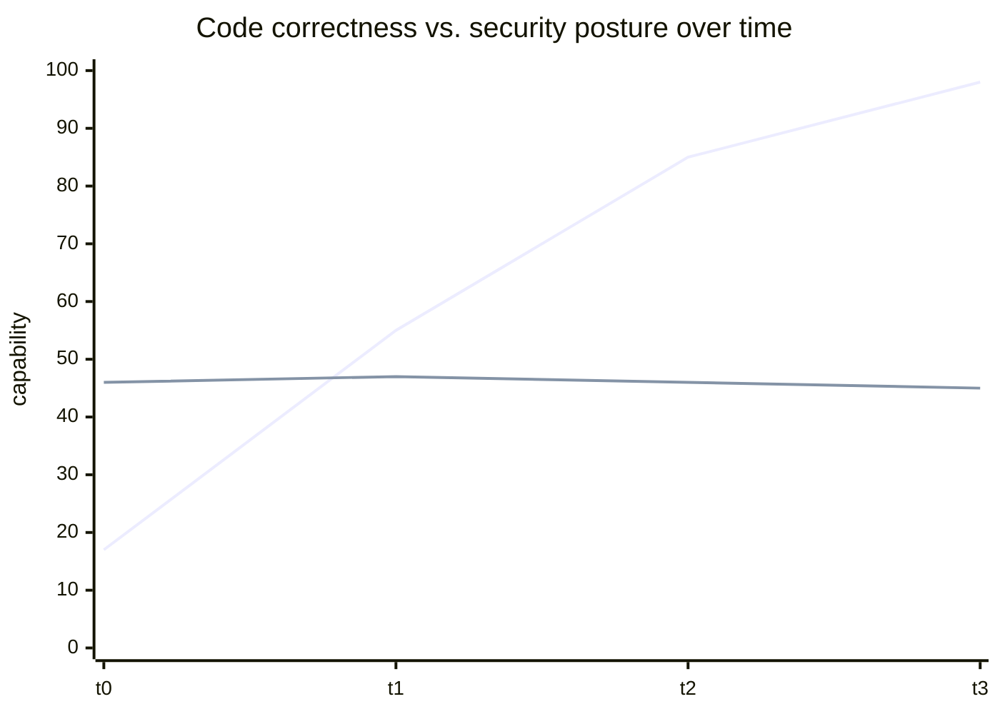

# The Hidden Vulnerabilities Behind AI Code

René Brandel — founder of **Casco** (autonomous security testing) and inventor of
**AWS Kiro** — on the AI Native Dev podcast. His team **hacked 7 of 16 publicly
launched Y Combinator spring-batch companies in 30 minutes.** Over 95% of that
batch used AI to help write code; a small team simply could not build secure
software fast enough to keep up with how fast AI let them ship. Brandel is the same
source behind the "syntactically correct vs. flat security posture" point in
[AI code security](ai-code-security.md).

## The core trend: correctness climbs, security stays flat

The models keep getting better at *code* — but plot the **security benchmarks** and
they are **flat, or even drifting down slightly.** So we now live in a world
**writing exponentially more code while the security posture has not improved.**
Volume goes up, defect *rate* holds, so the absolute number of vulnerabilities
explodes.

(Upper line: syntactic/functional correctness rising toward ~98%. Lower line:
security-benchmark success staying flat — the gap widens on its own.)

## Casco: a pen tester on steroids

Casco performs **autonomous security testing against AI apps and agents** — like a
pen tester that runs thousands of different attacks in parallel and tells you which
vulnerabilities are **truly exploitable**, so you fix the ones that matter rather
than drowning in scanner noise. This complements static scanning: dynamic,
adversarial, exploit-oriented, and built to scale with the volume of AI-generated
software. It sits alongside the "shift-left, make it automatic" posture in
[AI code security](ai-code-security.md) and the reviewer-shortage framing in
[Graphite's AI-native outer loop](graphite-ai-outer-loop.md).

## Related

- [AI code security](ai-code-security.md) — Brandel's flat-posture point in context.
- [Does AI generate secure code?](does-ai-generate-secure-code.md) — the training-data root cause.
- [Cisco CodeGuard](cisco-codeguard-security-skills.md) — steering the agent to write safer code up front.

## References
- [The Hidden Vulnerabilities Behind AI Code | René Brandel (AI Native Dev)](https://www.youtube.com/watch?v=mpLhEa1VBoI)
