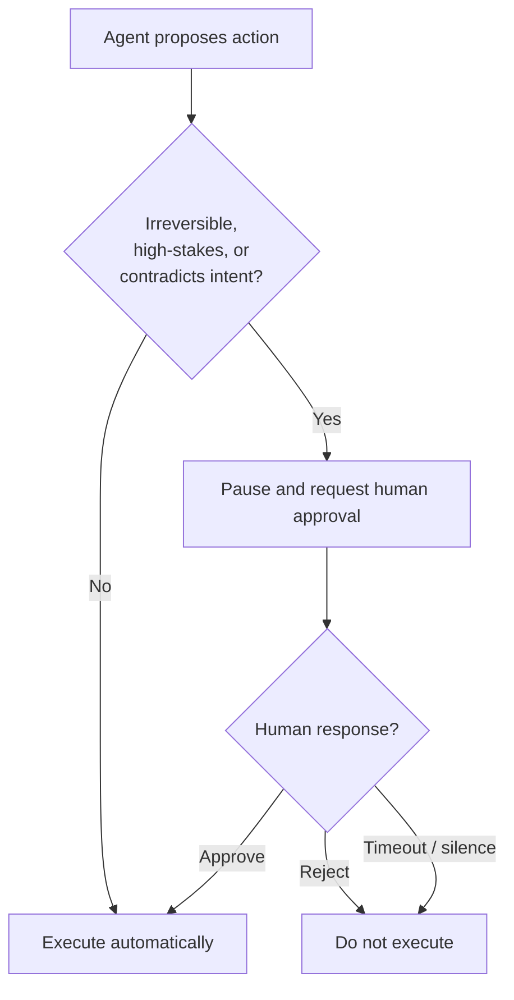

# Human-in-the-Loop: The Booking No One Approved

Part 7 of Rick Hightower's *Harness Engineering, Two Frameworks* series. The framing:
most agent guardrails check whether an action is *well-formed*; they never ask whether
anyone *should have done it at all*. Sarah asked for "economy, under $400, flexible dates."
The agent found a **$1,847 non-refundable business fare**, judged it acceptable given
"premium availability," and booked it. Ordinary input validation would not have caught this
— the fare was valid, the date real, the booking structurally clean. What failed was a
judgment call about whether an irreversible charge that contradicts the request should
execute without a person in the loop.

## The point: gate the small slice, not everything

Gating *every* action is a mistake — it destroys the autonomy that makes an agent worth
running. The discipline is to gate the **small slice that actually matters** and let the
model handle the rest. This matches the harness principle of *minimal necessary
intervention*: only step in for irreversible actions or security boundaries
(see [2025 Was Agents. 2026 Is Agent Harnesses.](2025-agents-2026-agent-harnesses.md)).

## The three conditions that route to a human

An action goes to a human when it is:

1. **Irreversible** — a non-refundable charge, a delete, an outbound email that can't be
   unsent.
2. **High-stakes** — large amounts, or actions that materially affect a customer or the
   business.
3. **Contradicting intent** — the action diverges from what the user actually asked for
   (Sarah asked for economy under $400; a $1,847 business fare fails this test even though
   it is a valid booking).

The routing is a rule the model cannot argue its way around, applied by the harness rather
than left to the model's own judgment.

## Pause and resume — the same contract, two shapes

Both frameworks let a run **pause at the gate, wait for a human decision, then resume**:

- **Claude Agent SDK:** the seam is the tool-use permission callback — the harness
  intercepts the tool call, surfaces it for approval, and only proceeds on an allow.
- **LangChain Deep Agents (LangGraph):** the seam is the **interrupt** primitive
  (v0.4 interrupt semantics) — `invoke()` surfaces an interrupt, and a resume value maps
  back to the interrupted point, supporting clean single- and multi-interrupt cycles.

The shapes differ; the contract is identical: stop before the irreversible, hand the
decision to a person, resume with their answer.

## The timeout policy: silence is denial

The hard part is not the pause — it is what happens when the human says nothing. The policy:
**treat a non-response as a denial, not a yes.** A timeout must fail closed. An approval gate
that lets the action through on silence is not a gate; it is a delay that still books the
wrong ticket.

## Why it matters

The human gate is the seam between automation and accountability. It is where a single
approval can save a customer and preserve the trust that makes higher autonomy acceptable at
all — the same tension examined in
[AI and the Ironies of Automation](ai-and-the-ironies-of-automation.md) and in the
[autonomy ladder](autonomy-ladder.md). It complements the series' other harness functions:
[durable recovery](hightower-the-retry.md),
[multi-agent orchestration](hightower-multi-agent-orchestration.md), and
[observability](hightower-observability.md). Kief Morris's
["on the loop"](humans-and-agents-morris.md) framing is the wider version of the same idea —
humans manage the loop rather than approve every step, gating only where it counts.

## References

- [Human-in-the-Loop: The Booking No One Approved — Rick Hightower](https://rickhigh.substack.com/p/harness-engineering-human-in-the)
