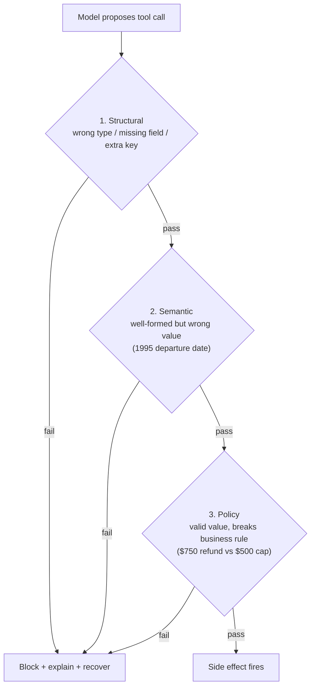

# Tool Contracts and Validators: Move the Rule Out of the Prompt

Part 2 of Rick Hightower's harness series. It closes the seam that produced the "March 32nd"
phantom booking: an agent will run a destructive call on impossible input as long as the
arguments *parse*. The fix is not a smarter model — it's a **deterministic check that sits
between the decision and the side effect.**

The load-bearing principle:

> Instructions are followed most of the time. Contracts get enforced every time.

## The plan-step contract

Every step an agent takes makes a claim ("I will produce output X"). Without something that
checks X deterministically before the action fires, you have a *suggestion*, not a
*guarantee*. A plan step declares a **precondition** it needs to run and a **postcondition**
it promises to produce, and the harness checks both.

The design rule lives upstream of the validator: an expected output is only useful if a
**non-LLM validator can evaluate it deterministically**. If you can't write code that
returns `True`/`False` for the output without calling a model, the output isn't verifiable.
Practical heuristic: *if a junior dev can write a unit test for the output without reading
any natural language, it's checkable; if the test needs human judgment about meaning, it's
not.*

This pushes you to design tool inputs and outputs as **typed, bounded values** rather than
free prose — `cabin_class` is an enum of four values, not a string the model fills with
`"eco"` or `"coach"`; `price_usd` lives in a range (a schema that accepts any float accepts
`-1.0` and `999999.99` with equal enthusiasm); `departure_date` must be in the future,
which JSON Schema can't express but a one-line function can.

## Three validation layers, cheapest first

1. **Structural** — wrong type, missing field, extra key. Caught by schema-forced output.
2. **Semantic** — well-formed but wrong value (a 1995 departure date). Caught by code.
3. **Policy** — a valid value that violates a business rule (a $750 refund against a $500
   cap). Caught by a guard at the **action boundary** — the single most load-bearing
   control in any agent.

## Build it twice, and recover

The essay builds one shared validator implemented two ways: a Claude Agent SDK `PreToolUse`
hook and a LangChain Deep Agents `wrap_tool_call` middleware. Critically, a blocked call
should turn into a **recovery** (feed the reason back so the agent corrects) rather than a
hard failure.

## Related notes

- [The naked agent (Hightower)](hightower-the-naked-agent.md) — Part 1; this closes its Failure 1.
- [What Is Harness Engineering? (Hightower)](hightower-what-is-harness-engineering.md) — the discipline framing.
- [Guardrails proxy](guardrails-proxy.md), [LLM safeguards](llm-safeguards.md) — deterministic controls around models.
- [OWASP LLM Top 10](owasp-llm-top-10.md) — why the action boundary matters for security.
- [Execution sandboxing](execution-sandboxing.md) — the complementary control on *effects*, where validators gate *inputs*.

## References

- [Tool Contracts and Validators: Move the Rule Out of the Prompt](https://rickhigh.substack.com/p/tool-contracts-and-validators-move) — Rick Hightower
