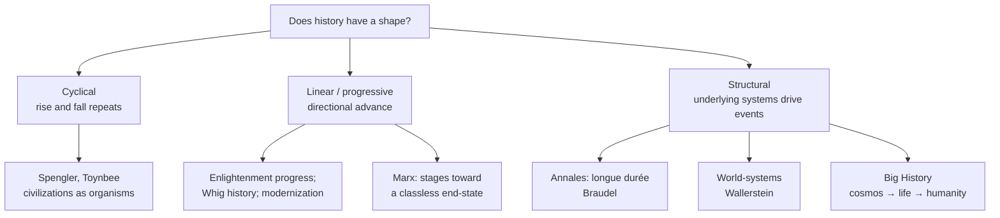

# Big History and Theories of History

Most history is the study of particular events in a bounded place and time. **Macrohistory**
and the **philosophy of history** ask a different question: does the whole sweep of the past
have a *shape*? Is there a direction, a pattern, a mechanism — or is history "just one damned
thing after another"? This note surveys the major answers, from ancient cyclical views to
"Big History," and asks what, if anything, they explain. It sits alongside the more
methodological
[historiography-and-historical-method.md](historiography-and-historical-method.md), which
treats *how* we know the past rather than *what shape* it has.

## Shapes of time

### Cyclical theories

The oldest view — found in many traditions — sees history as recurring cycles of rise,
maturity, and decline. Its most ambitious modern forms are **Oswald Spengler's** *Decline of
the West* and **Arnold Toynbee's** *A Study of History*, which treat civilizations as
quasi-organisms that grow, flourish, and die in response to "challenge and response."
Powerful as narrative, these grand schemes are now largely rejected by professional
historians as untestable and over-fitted — though the intuition that empires rise and fall
retains obvious appeal.

### Linear and progressive theories

The Enlightenment bequeathed a directional story: history as **progress** toward reason,
liberty, and prosperity (see
[revolutions-enlightenment-and-industrial.md](revolutions-enlightenment-and-industrial.md)).
"Whig history" and later modernization theory read the past as a march toward the present.
The most rigorous progressive theory is **Karl Marx's historical materialism**: the *mode of
production* (the economic base) drives social and political change through class conflict,
propelling history through stages toward an end-state. It is the intellectual root of the
ideologies traced in
[../political-science/political-theory-and-ideologies.md](../political-science/political-theory-and-ideologies.md).
Historians credit materialism for putting economy and class at the center of analysis while
rejecting its determinism and its teleological end-point.

### Structural theories

Rather than events or great men, these approaches foreground slow, deep structures:

- **The Annales school** (Marc Bloch, Lucien Febvre, and above all **Fernand Braudel**)
  distinguished the *longue durée* — geography, climate, demographic and material rhythms
  that change over centuries — from the fast "event history" of politics. History's real
  causes, they argued, lie in the slow layers.
- **World-systems theory** (Immanuel Wallerstein) analyzes not nations but a single
  capitalist world-economy divided into **core, periphery, and semi-periphery** — a structural
  reading of the inequalities born in
  [imperialism-and-nationalism.md](imperialism-and-nationalism.md) and extended into
  [globalization-and-the-contemporary-world.md](globalization-and-the-contemporary-world.md).

### Big History

**Big History** widens the frame to the maximum: it tells a single continuous story from the
Big Bang through the formation of stars and planets, the origin of life, and human history,
organized around rising **complexity** at successive "thresholds." It treats the human past as
one chapter in cosmic evolution and is explicitly interdisciplinary, borrowing from physics,
chemistry, and biology. This systems framing connects history to
[../systems-thinking/complex-adaptive-systems.md](../systems-thinking/complex-adaptive-systems.md)
and to the [../philosophy/philosophy-of-science.md](../philosophy/philosophy-of-science.md)
question of what counts as a scientific explanation of a one-time sequence.

## The grand-narrative debates

The popular "big history" syntheses embody the competing instincts:

- [harari-sapiens.md](harari-sapiens.md) — a sweeping narrative organized around cognitive,
  agricultural, and scientific "revolutions" and the power of shared fictions. Praised for
  scope, criticized for confident generalization.
- [diamond-guns-germs-and-steel.md](diamond-guns-germs-and-steel.md) — geographic and
  ecological determinism: why some societies dominated others. Praised for banishing racial
  explanation, criticized for underweighting culture, agency, and contingency.
- [mcneill-rise-of-the-west.md](mcneill-rise-of-the-west.md) — a diffusionist, contact-driven
  world history in which cross-cultural exchange is the engine; the author himself later
  softened its Western-centric title and thesis.

The core tension across all of these: **structure vs. contingency** (do deep forces determine
outcomes, or do accidents and choices matter?) and **explanation vs. narrative** (can
macrohistory be a science, or is the grand scheme always a story we impose?). This is where
philosophy of history meets the working historian's skepticism in
[historiography-and-historical-method.md](historiography-and-historical-method.md).

## Why it matters

Every synthesis of the past — including the earlier notes in this folder — rests on an
implicit theory of what drives history. Naming those theories lets us read any big claim
critically: to ask whether it is testable, whether it smuggles in a teleology, and whether it
mistakes a compelling story for a demonstrated cause. That skepticism is exactly what the AI
era demands as it invites ever grander data-driven narratives about "where history is going."

## References

Concept note — synthesized from the field of world history and the philosophy of history.
Anchor works: [mcneill-rise-of-the-west.md](mcneill-rise-of-the-west.md),
[harari-sapiens.md](harari-sapiens.md), and
[diamond-guns-germs-and-steel.md](diamond-guns-germs-and-steel.md).
