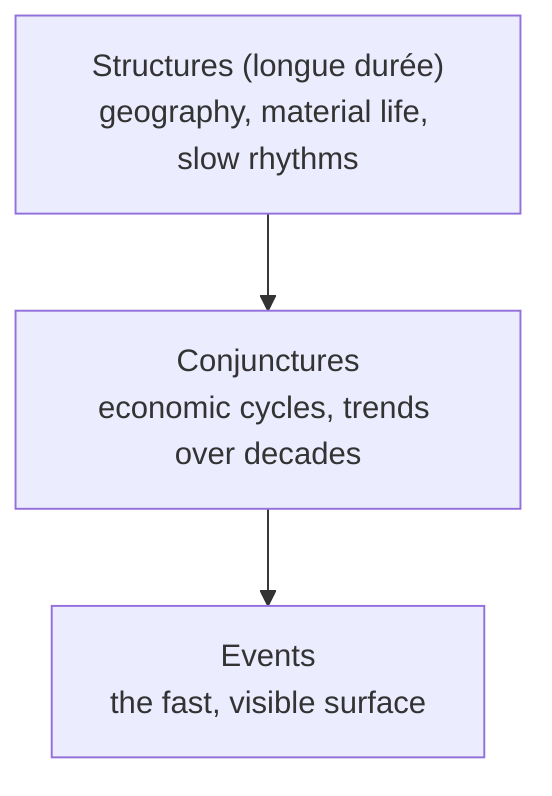

# Civilization and Capitalism, 15th–18th Century

Fernand Braudel's three-volume *Civilization and Capitalism, 15th–18th Century*
(*Civilisation matérielle, économie et capitalisme, XVe–XVIIIe siècle*; volumes 1967–1979)
is the crowning work of the **Annales School** and one of the most ambitious economic
histories ever written. It reconstructs how ordinary people made pre-industrial economies
work and how, within that world of everyday material life, **capitalism** slowly took shape.

## The longue durée and the three levels of time

Braudel's signature method is the ***longue durée*** — the long span. Against a history
fixated on events and personalities (*histoire événementielle*, the *courte durée*), he
insists that what matters most are the **deep, slow-moving structures** of geography,
climate, technology, and daily habit, which change over centuries and constrain what any
individual or generation can do. He stratifies historical time into three levels, and
*Civilization and Capitalism* is built to mirror them:

## The three volumes

- **Vol. I — *The Structures of Everyday Life*.** The material substratum: population, food
  and drink, housing, clothing and fashion, technology, money, and towns — the routine
  "material civilization" most people lived inside without choosing it. This is history from
  below, told through the texture of daily existence.
- **Vol. II — *The Wheels of Commerce*.** The **market economy** proper: markets, fairs,
  merchants, credit, and exchange — the transparent, competitive world of small-scale trade.
- **Vol. III — *The Perspective of the World*.** Where Braudel argues **capitalism** is
  distinct from the market: a top layer of large-scale, monopoly-seeking, often speculative
  activity operating *above* ordinary competition. He maps a succession of dominant
  **world-economies** (économies-monde), each centered on a commanding city — Venice, then
  Antwerp, Genoa, Amsterdam, London — that organized long-distance exchange across vast
  zones. This volume was influenced by Werner Sombart and traces the reach of Western
  capitalist centers over the rest of the world.

A key conceptual move is Braudel's **three-tier model of the economy**: material life at the
base, the market economy in the middle, and capitalism as a distinct upper storey where the
big players bend the rules in their favor. Written partly as a **refutation of the orthodox
Marxist stages of history**, it nonetheless shares materialism's attention to the economic
foundations of society.

## Significance

The work defines the Annales approach for economic and social history and supplies core
vocabulary — *longue durée*, world-economy, the market/capitalism distinction — that shaped
later scholarship, including Immanuel Wallerstein's world-systems theory. Its panoramic view
of long-distance commerce, dominant cities, and material exchange makes it a foundational
reference for
[trade-networks-and-cross-cultural-exchange.md](trade-networks-and-cross-cultural-exchange.md)
and for
[early-modern-and-global-connection.md](early-modern-and-global-connection.md). Methodologically
it is a touchstone for
[historiography-and-historical-method.md](historiography-and-historical-method.md).

## Critiques

The very strengths of Braudel's method draw the standard objections. By privileging the
*longue durée* and "downplaying the importance of specific events," critics argue he leaves
too little room for **human agency, politics, and rupture** — history as almost geological,
beyond the reach of conscious actors. His categories (especially the sharp line between
"market economy" and "capitalism") have been contested as more schematic than the evidence
supports, and his synthesis is so vast that few historians attempted to replicate it,
retreating instead to specialized monographs. Even so, *Civilization and Capitalism* remains
a model of *histoire totale* — history that integrates geography, economy, and everyday
culture into one sweep.

## References

- [Civilization and Capitalism, 15th–18th Century, Vol. I — University of California Press](https://www.ucpress.edu/books/civilization-and-capitalism-15th-18th-century-vol-i/paper)
