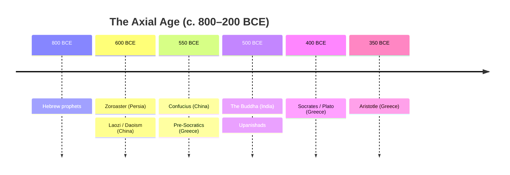

# Classical Antiquity

"Classical antiquity" is conventionally the roughly thousand-year stretch from about the
8th century BCE to the 5th–6th centuries CE, when several of Eurasia's early
civilizations (see [early-civilizations](early-civilizations.md)) matured into
large-scale empires, elaborated durable philosophical and religious systems, and left
literary, legal, and institutional legacies that later societies would repeatedly invoke.
Older textbooks used "classical" almost exclusively for Greece and Rome. A global reading
corrects that Eurocentric habit: the same centuries produced the Achaemenid Persian
Empire, Mauryan India, and Han China — polities of comparable or greater scale, wealth,
and sophistication — connected by the trade routes examined in
[trade-networks-and-cross-cultural-exchange](trade-networks-and-cross-cultural-exchange.md).

## A world of parallel empires

The period's defining political form is the **territorial empire**: a state ruling many
peoples over vast distances through roads, coinage, standardized law or administration,
and an official language or bureaucratic elite. What is striking to comparative
historians is how *simultaneously* these appeared across Eurasia.

| Civilization | Rough peak | Signature institutions |
|---|---|---|
| Achaemenid Persia | c. 550–330 BCE | satrapies, Royal Road, tolerant multi-ethnic rule |
| Greek world | c. 500–300 BCE | the *polis*, democracy at Athens, Hellenistic diffusion after Alexander |
| Mauryan India | c. 321–185 BCE | centralized administration, Ashoka's edicts and Buddhist patronage |
| Han China | 206 BCE–220 CE | Confucian bureaucracy, examination ideal, the Silk Road opening |
| Roman Empire | c. 27 BCE–476 CE (West) | citizenship, codified law, engineering, the *Pax Romana* |

Alexander's conquests (334–323 BCE) fused Greek and Near Eastern worlds into the
**Hellenistic** oecumene, and Rome later absorbed and transmitted that Greek inheritance.
In East Asia the Han consolidated the unification begun by the short-lived Qin, binding
governance to a Confucian moral-administrative synthesis that outlasted every dynasty
that used it.

## The Axial Age

The philosopher Karl Jaspers coined **Achsenzeit ("Axial Age")** for the observation that,
between roughly 800 and 200 BCE, foundational thinkers arose independently across several
civilizations: the Hebrew prophets and, later, the roots of the Abrahamic line (see
[../religion/abrahamic-traditions.md](../religion/abrahamic-traditions.md)); the
pre-Socratics, Socrates, Plato, and Aristotle in Greece; the Buddha and the authors of
the Upanishads in India; Confucius, Laozi, and the "hundred schools" in China; and
Zoroaster in Persia. Jaspers argued these traditions shared a turn toward reflective,
universalizing, transcendence-oriented thought — the birth of philosophy and of the
world religions surveyed in
[../religion/comparative-religion-and-world-traditions.md](../religion/comparative-religion-and-world-traditions.md)
and the traditions catalogued in [../philosophy/index.md](../philosophy/index.md).

The Axial Age thesis is contested — the dating is loose, the "simultaneity" partly an
artifact of how the categories are drawn, and India's and China's developments do not map
neatly onto a single "breakthrough." But it remains a productive frame for asking why
reflective ethical universalism emerged when and where it did, and it is a favorite of
macro-historians such as those in [big-history-and-theories-of-history](big-history-and-theories-of-history.md).

## Law, citizenship, and administration

Classical states pioneered forms of governance later societies mined for models (see
[../political-science/forms-of-government.md](../political-science/forms-of-government.md)).
Athenian **democracy** — direct rule by an assembly of male citizens, resting on excluded
slaves and women — became the reference point for later republican thought. Rome's
extension of **citizenship** and its systematized **law** (culminating in the 6th-century
Justinianic codification) shaped European legal traditions for a millennium. Han China's
ideal of a **merit-recruited bureaucracy** governed by moral cultivation offered a
radically different template, one that arguably proved more administratively durable than
anything in the Mediterranean.

## Historiographical debates

- **Decline and fall.** Edward Gibbon framed Rome's end as a "decline"; recent
  scholarship (Peter Brown, the "Late Antiquity" school) sees transformation and
  continuity rather than catastrophe, blurring the line into
  [the-medieval-world](the-medieval-world.md).
- **How connected was it?** The degree of contact between Rome, Persia, India, and Han
  China is debated; the Silk Road existed, but sustained direct exchange was thinner than
  popular accounts imply — a caution [Herodotus](herodotus-histories.md), our first
  self-conscious inquirer into other peoples, already models in his mix of report and
  skepticism.
- **The Eurocentric canon.** The very word "classical" carries a value judgment. Treating
  Han China or Mauryan India as equally "classical" is itself a historiographical
  correction, and grand narratives like [McNeill](mcneill-rise-of-the-west.md) have been
  revised precisely to widen the frame.

## Why it matters

Classical antiquity is where the empire as a governing form, the world philosophies and
religions, codified law, and the ideal of the citizen were first worked out at scale —
and where several civilizations did so in parallel. Understanding the period as global
rather than Greco-Roman is the first step toward a genuinely world history, and its
institutions and ideas remained live reference points through
[the-medieval-world](the-medieval-world.md) and beyond.

## References

- Concept note — synthesized from the general historiography of classical antiquity; no
  single source. Cross-linked to [early-civilizations](early-civilizations.md),
  [the-medieval-world](the-medieval-world.md),
  [trade-networks-and-cross-cultural-exchange](trade-networks-and-cross-cultural-exchange.md),
  [../philosophy/index.md](../philosophy/index.md), and
  [../religion/comparative-religion-and-world-traditions.md](../religion/comparative-religion-and-world-traditions.md).
