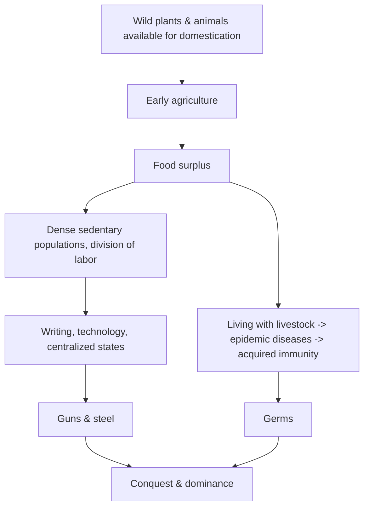

# Guns, Germs, and Steel

Jared Diamond's *Guns, Germs, and Steel: The Fates of Human Societies* (1997, Pulitzer
Prize 1998) sets out to answer a single deceptively simple question — posed to Diamond by
a New Guinean politician named Yali: **why did some peoples end up with so much material
wealth and power, and others with so little?** Diamond's answer is that the ultimate cause
is **geography and environment**, not any innate difference between peoples.

## Central thesis

The proximate reasons Europeans could conquer other continents were the "guns, germs, and
steel" of the title — military technology, epidemic diseases, and state organization. But
Diamond argues these are downstream of a deeper, **environmental** cause: the uneven global
distribution of resources that made **food production** possible early in some places and
late or never in others.

The causal chain runs roughly:

Two geographic facts do the heavy lifting. First, the **Fertile Crescent** happened to
hold an unusual concentration of easily domesticable wild grasses (wheat, barley) and of
the world's few large domesticable mammals — Diamond counts only 14 such species, most
native to Eurasia. Second, Eurasia's **east–west axis** let crops, animals, and techniques
spread readily across shared latitudes and climates, whereas the Americas' and Africa's
**north–south axes** forced innovations across climate barriers, slowing diffusion. This
head start compounded over millennia. Domesticated animals also seeded the crowd diseases
(smallpox, measles) that later devastated populations lacking immunity — making germs a
weapon of conquest as decisive as steel.

## Scope and significance

The book is a grand synthesis across archaeology, biology, linguistics, and geography,
covering roughly 13,000 years across every inhabited continent. Its lasting contribution
is to offer a **non-racial** explanation for global inequality: the differences in
outcomes trace to the accidents of where peoples found themselves, not to differences
among the peoples. This anchors big questions about
[the-agricultural-revolution.md](the-agricultural-revolution.md) — why farming arose where
and when it did — and about the trajectories of
[early-civilizations.md](early-civilizations.md) that food surpluses made possible. It sits
in the tradition of geographically-minded history running back to the Annales School (see
[big-history-and-theories-of-history.md](big-history-and-theories-of-history.md)).

## The determinism critique

*Guns, Germs, and Steel* is as famous for the objections it draws as for its argument.
The core charge is **environmental (geographic) determinism**: by making Europe's
ascendancy a "product of a distant and accidental history," critics argue Diamond leaves
almost no room for **human agency** — the decisions, institutions, and culture through
which people shape outcomes. The anthropologist and geographer James M. Blaut accused
Diamond of reviving environmental determinism and of a subtly **Eurocentric** framing,
noting his loose use of "Eurasia" that lets Western Europe implicitly claim credit for
inventions that actually arose in the Middle East and Asia. Others (e.g. the anthropologist
Jason Antrosio) dismissed it as compelling but reductive "academic porn." Economic
historian Joel Mokyr, while calling Diamond a determinist, judged him a sophisticated one
and the book "one of the more important contributions to long-term economic history" —
faulting mainly the claim that domesticable-species endowments were fixed, since crops can
be manipulated and selected, and the neglect of how harsh environments themselves spur
ingenuity. The general methodological lesson — the tension between structural/material
explanation and contingency/agency — is a live theme in
[historiography-and-historical-method.md](historiography-and-historical-method.md).

## References

- [Guns, Germs, and Steel — W. W. Norton & Company](https://wwnorton.com/books/Guns-Germs-and-Steel)
