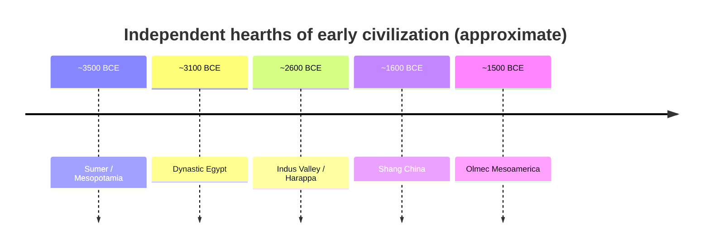

# Early Civilizations

Roughly 5,000–3,000 years ago, in several river valleys and highlands around the world,
the surplus and settlement produced by [the-agricultural-revolution](the-agricultural-revolution.md)
crystallized into something new: **cities and states** — dense populations governed by
centralized authority, supporting specialists, monuments, writing, and law. These "first
civilizations" arose largely independently, which makes their common features especially
telling. As with domestication, the pattern repeated across the globe rather than radiating
from one source — a point [diamond-guns-germs-and-steel](diamond-guns-germs-and-steel.md)
ties to the differing raw materials each region inherited.

## The primary hearths

- **Mesopotamia** (Tigris–Euphrates, from ~3500 BCE). Sumer's city-states pioneered
  **cuneiform** writing, the wheel, monumental *ziggurats*, and codified law (the Code of
  Hammurabi). Often called the earliest urban civilization.
- **Egypt** (Nile, from ~3100 BCE). A unified, remarkably durable state built on the Nile's
  predictable flood, with **hieroglyphic** writing, divine kingship (pharaohs), and the
  pyramids.
- **Indus Valley / Harappa** (from ~2600 BCE). Large, strikingly *planned* cities
  (Mohenjo-daro, Harappa) with standardized brick, grid streets, and advanced drainage — and
  a script still undeciphered, so its politics and beliefs remain largely opaque.
- **Shang China** (Yellow River, from ~1600 BCE). Bronze ritual vessels, ancestor worship,
  and **oracle-bone** inscriptions ancestral to modern Chinese writing.
- **Mesoamerica** (Olmec from ~1500 BCE, later Maya). Independent invention of writing,
  a sophisticated calendar and zero, and monumental pyramids — with *no* draft animals or
  wheeled transport, showing how many paths converge on "civilization."

## Shared markers

Across these independent origins a recurring cluster appears:

- **Writing** — record-keeping born of taxation and administration, later carrying law,
  literature, and religion. Writing is the conventional boundary between "prehistory" and
  "history" (see [historiography-and-historical-method](historiography-and-historical-method.md)).
- **Metallurgy** — the Bronze Age: alloying copper and tin for tools, weapons, and prestige
  goods, driving [trade-networks-and-cross-cultural-exchange](trade-networks-and-cross-cultural-exchange.md)
  since tin sources were rare and distant.
- **Cities** — dense populations concentrating people, specialists, and power.
- **Monumental architecture** — temples, pyramids, palaces: labor mobilized to project
  authority and cosmology.
- **Bureaucracy and law** — scribes, officials, standardized weights and codes to run a
  society too large for face-to-face rule.
- **The state** — centralized, coercive authority claiming legitimacy, taxing surplus, and
  monopolizing organized force. This is the deep origin of the entity analyzed in
  [the-state-and-sovereignty](../political-science/the-state-and-sovereignty.md).

## Critiquing "civilization"

The word **"civilization"** is not innocent. Historically it was used to rank societies —
"civilized" against "barbarian" or "savage" — and to justify conquest and colonialism, so
world historians handle it warily. Several cautions apply:

- **The checklist is Eurasian-shaped.** Fixating on writing, cities, and metal can render
  invisible complex societies that organized differently (e.g. mobile pastoralists, or the
  earthwork-building societies of the Amazon and North America).
- **Complexity without the "package."** Recent archaeology shows large settlements and
  monumental works (Göbekli Tepe, Çatalhöyük) that predate or lack states, cities, or full
  farming — so the tidy sequence *surplus → hierarchy → state* is looser and more varied
  than the classic story claims.
- **Civilization's cost.** Cities brought epidemic disease, entrenched hierarchy, slavery,
  patriarchy, and organized war alongside their achievements — the trade-off already flagged
  for farming in [harari-sapiens](harari-sapiens.md).

Contemporary scholarship therefore prefers neutral language ("early states," "complex
societies") and stresses variety over a single ladder of progress — the same skepticism
toward grand schemes discussed in
[big-history-and-theories-of-history](big-history-and-theories-of-history.md).

## Why it matters

The early civilizations invented the operating system of most subsequent human life:
writing, law, bureaucracy, taxation, organized religion, the city, and the state. They set
the stage for the empires and cross-regional systems of
[classical-antiquity](classical-antiquity.md). Studying them comparatively — across five
independent origins rather than one — is the strongest available evidence about what humans
tend to build when surplus and scale allow, and what that building costs.

## References

- [diamond-guns-germs-and-steel](diamond-guns-germs-and-steel.md)
- [the-agricultural-revolution](the-agricultural-revolution.md)
- [the-state-and-sovereignty](../political-science/the-state-and-sovereignty.md)
