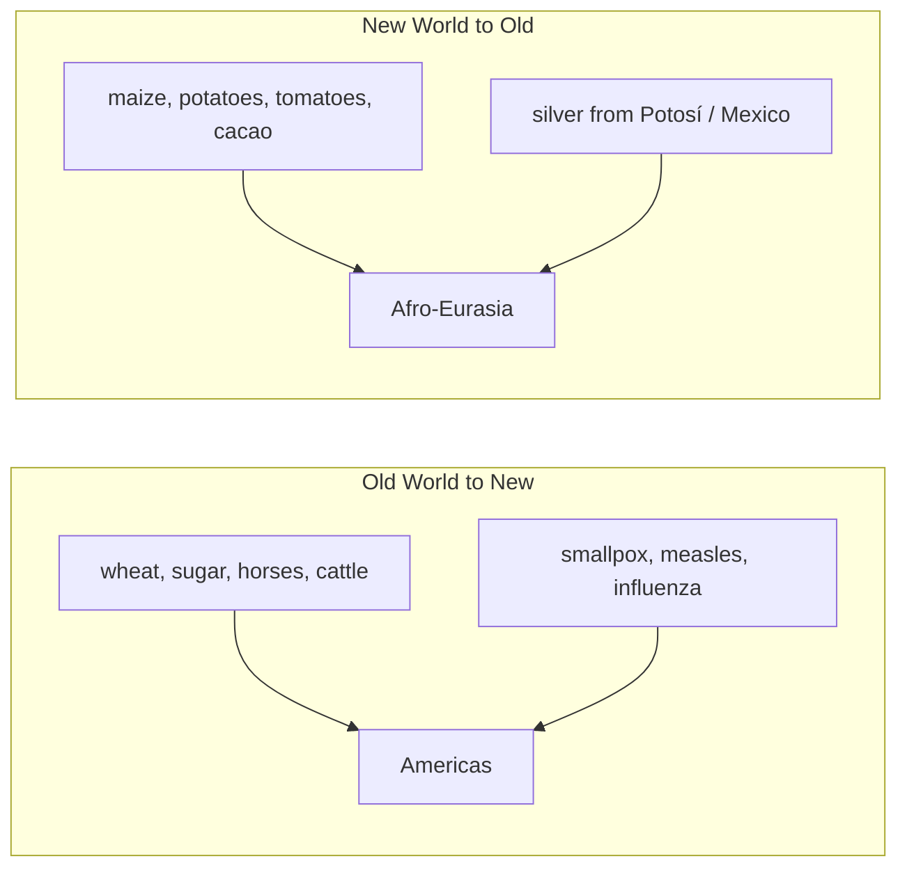

# Early Modern and Global Connection

The **early modern** period, roughly **1450–1750**, is the hinge on which world history
turns from a set of interlinked-but-separate Afro-Eurasian circuits (see
[trade-networks-and-cross-cultural-exchange](trade-networks-and-cross-cultural-exchange.md))
into a single, genuinely **global** system spanning all inhabited continents. For the
first time the Americas were bound to Africa, Europe, and Asia in continuous exchange of
goods, people, plants, animals, silver, and microbes. Braudel's account of the emergence
of a world economy and of capitalism in exactly these centuries
([braudel-civilization-and-capitalism.md](braudel-civilization-and-capitalism.md)) is the
analytic backbone here (see also [../economics/index.md](../economics/index.md)).

## The age of exploration and the Columbian Exchange

European maritime expansion — Portuguese along the African coast to the Indian Ocean,
then the Spanish across the Atlantic after 1492 — did not so much *discover* a connected
world as force the Americas into it. The consequence was the **Columbian Exchange**: the
biological transfer between hemispheres that reshaped both.

American crops (maize, potatoes, cassava) drove population growth across Afro-Eurasia,
while Old World **diseases** — to which Native Americans had no immunity — caused
demographic collapse that some estimate at up to 90% in the century after contact. American
**silver**, above all from Potosí, became the money that greased a truly world economy,
flowing east to pay for Chinese silk and porcelain.

## The gunpowder empires

Europe was not the only, or even the dominant, power of the age. Across Asia rose the
great **gunpowder empires** — states that used firearms and artillery to build large,
centralized realms (see
[../political-science/forms-of-government.md](../political-science/forms-of-government.md)):

| Empire | Region | Note |
|---|---|---|
| Ottoman | Anatolia, Balkans, Middle East | took Constantinople 1453; straddled three continents |
| Safavid | Persia | established Twelver Shi'a Islam as state religion |
| Mughal | South Asia | wealthy, syncretic; peak under Akbar and successors |
| Ming / Qing | China | the world's largest economy; Zheng He's fleets, then inward turn |

Through most of this period these were richer and more powerful than any European state —
a fact easily lost in narratives that read backward from later European dominance.

## Renaissance, Reformation, and the Atlantic slave trade

Within Europe, the **Renaissance** revived classical learning (see
[classical-antiquity](classical-antiquity.md)) and, with printing, accelerated the
circulation of ideas; the **Reformation** (from 1517) shattered Latin Christian unity,
one branch of the [../religion/abrahamic-traditions.md](../religion/abrahamic-traditions.md),
and unleashed a century of religious war. The darkest structural feature of the new
Atlantic economy was the **transatlantic slave trade**: over roughly four centuries some
12 million Africans were forcibly transported to the Americas to produce sugar, tobacco,
and later cotton. Racialized plantation slavery was foundational to the early modern
global economy, not incidental to it — a moral and economic fact that later revolutions
and abolition movements would confront (see
[revolutions-enlightenment-and-industrial](revolutions-enlightenment-and-industrial.md)).

## The first global economy

By 1600 a genuinely worldwide circulation existed: American silver bought Asian goods,
African labor produced American commodities, and European merchant capital and
chartered companies (the Dutch and English East India Companies) organized long-distance
trade at unprecedented scale. This is the world economy Braudel analyzed and the seedbed
of the capitalism examined in [../economics/index.md](../economics/index.md).

## Historiographical debates

- **The Great Divergence.** Was Europe already exceptional, or roughly on par with China
  and India until c. 1800? Kenneth Pomeranz's argument for a *late, contingent* divergence
  reframes the whole period and revises grand "rise of the West" narratives such as
  [McNeill](mcneill-rise-of-the-west.md).
- **Agency and the Columbian Exchange.** Alfred Crosby's biological framing shifts causation
  from European heroics to germs, crops, and ecology.
- **Was there a "military revolution"?** Whether firearms *caused* early modern state
  centralization, or merely accompanied it, is debated.
- **Continuity vs. rupture.** How sharp a break 1450–1750 really was from the medieval
  world (see [the-medieval-world](the-medieval-world.md)) depends on whether one weights
  the new Atlantic connections or the older Afro-Eurasian continuities.

## Why it matters

The early modern era created the interconnected world we still inhabit: the crops on our
plates, the demographic map of the Americas, the racial legacies of Atlantic slavery, and
the capitalist world economy all originate here. It is the essential bridge between the
polycentric medieval world and the revolutions, industrialization, and empire that made
the modern age (see [revolutions-enlightenment-and-industrial](revolutions-enlightenment-and-industrial.md)).

## References

- Concept note — synthesized from early-modern world historiography; no single source.
  Anchored to
  [braudel-civilization-and-capitalism.md](braudel-civilization-and-capitalism.md) and
  cross-linked to
  [trade-networks-and-cross-cultural-exchange](trade-networks-and-cross-cultural-exchange.md),
  [revolutions-enlightenment-and-industrial](revolutions-enlightenment-and-industrial.md),
  and [../economics/index.md](../economics/index.md).
