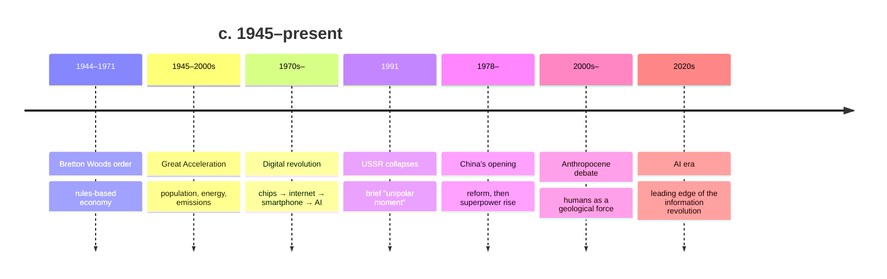

# Globalization and the Contemporary World

From the end of the Second World War to the present, the human world has become more tightly
interconnected — economically, technologically, and ecologically — than at any prior moment.
This note covers that arc: the postwar order, the information revolution, economic
globalization, the collapse of the USSR, the rise of China, the arrival of the Anthropocene,
and the still-unfolding AI era. It picks up directly where
[the-twentieth-century-wars-and-cold-war.md](the-twentieth-century-wars-and-cold-war.md)
ends. Historians writing about the very recent past do so with a caution worth stating up
front: we lack the distance to know which of today's events will look decisive in a century
(see [historiography-and-historical-method.md](historiography-and-historical-method.md)).

## The postwar order and the great acceleration

The victors of 1945 built a rules-based international architecture — the United Nations,
the Bretton Woods institutions (IMF, World Bank), and the trade regime that became the WTO —
designed to prevent a repeat of the interwar collapse. Under this order, and especially after
the Cold War, world trade, travel, migration, and communication surged. The postwar decades
also began the **"Great Acceleration"**: a sharp, synchronized rise in population, energy use,
resource extraction, and greenhouse emissions.

## The information and digital revolution

The transistor, the integrated circuit, the personal computer, the internet, and the
smartphone compressed the cost of storing, moving, and processing information toward zero.
This is a general-purpose technological shift comparable in scope to steam or electricity —
the newest chapter in the long story of
[../economics/economic-growth.md](../economics/economic-growth.md) — and it made the
just-in-time global supply chains and instantaneous capital flows of modern globalization
possible. The **AI era** now unfolding sits at the leading edge of this same arc; where it
lands in the long view is exactly the open question, and the applied consequences for how
organizations work are the subject of [../ai-org/index.md](../ai-org/index.md).

## The post-Cold-War reordering

The Soviet collapse in 1991 produced a brief American-led "unipolar moment" and triumphalist
"end of history" claims. That reading did not hold. The **rise of China** — from Deng
Xiaoping's 1978 reforms to the world's second-largest economy and a peer competitor —
returned the international system toward multipolarity and revived great-power dynamics
studied in
[../political-science/international-relations.md](../political-science/international-relations.md).
Globalization also generated backlash: financial crises, rising inequality within rich
countries, migration pressures, and populist and nationalist reactions.

## The Anthropocene

Perhaps the defining feature of the contemporary world is that **humanity has become a
geological force**. Climate change, biodiversity loss, and altered planetary cycles have led
scientists to propose the "Anthropocene" as a new epoch. This reframes all of human history
as embedded in — and now reshaping — Earth systems, the framing that motivates
[big-history-and-theories-of-history.md](big-history-and-theories-of-history.md). It also
casts globalization as a **complex adaptive system**: densely coupled, self-organizing, and
prone to nonlinear shocks (pandemics, financial contagion, cascading supply-chain failures) —
see [../systems-thinking/complex-adaptive-systems.md](../systems-thinking/complex-adaptive-systems.md).

## Historiographical debates

- **Is globalization new?** World-systems and "archaic globalization" scholars trace deep
  roots (see [trade-networks-and-cross-cultural-exchange.md](trade-networks-and-cross-cultural-exchange.md)
  and [early-modern-and-global-connection.md](early-modern-and-global-connection.md)); others
  see the post-1970s integration as a genuine break in degree and kind.
- **Convergence or divergence?** Did globalization narrow the gap between rich and poor
  countries (via China and India) or widen inequality within them? Both, in different places
  — the economics is contested; see [../economics/index.md](../economics/index.md).
- **When did the Anthropocene begin?** Candidates range from early agriculture, to 1610, to
  the 1780s, to the mid-twentieth-century "great acceleration" — a debate about human agency
  and periodization as much as about geology.
- **The limits of contemporary history.** Writing history "without hindsight" risks
  mistaking noise for signal; the discipline is openly wary of its own recency bias.

## Why it matters

The contemporary world is the endpoint of every earlier note in this folder and the
environment in which current decisions — technological, political, ecological — are made. Its
scale and interconnection mean that the AI era does not arrive on a blank slate but at the
leading edge of a centuries-long acceleration.

## References

Concept note — synthesized from the field of world history. See
[hobsbawm-age-of-extremes.md](hobsbawm-age-of-extremes.md) for the century that precedes this
one and [harari-sapiens.md](harari-sapiens.md) for the long-arc framing.
