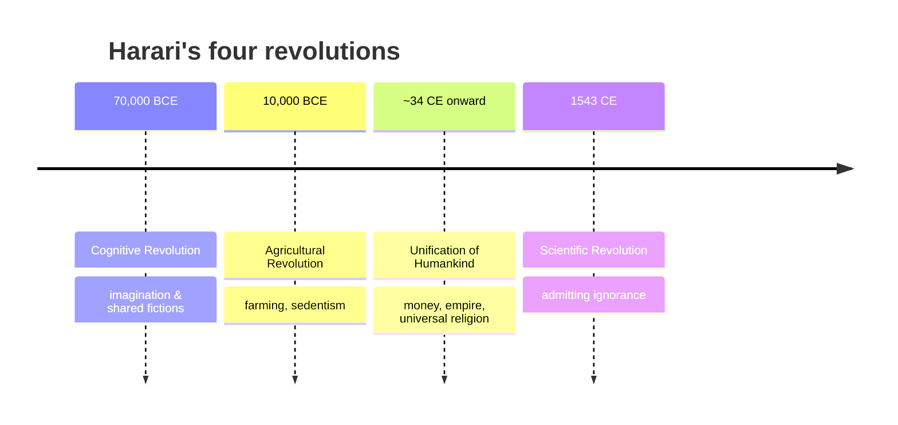

# Sapiens: A Brief History of Humankind

Yuval Noah Harari's *Sapiens: A Brief History of Humankind* (Hebrew 2011, English 2014) is
the defining popular **grand narrative** of the last decade — a single accessible sweep
from the emergence of *Homo sapiens* to the present and beyond. It places human history
within a frame where the natural sciences set the outer limits of what is possible and the
social sciences explain what happens inside those limits; history, for Harari, is the
account of cultural change.

## The four revolutions

Harari organizes the human story around four turning points:

1. **The Cognitive Revolution** (~70,000 years ago). A change in *Sapiens* cognition
   enabled complex language and, crucially, the capacity to believe in **shared fictions** —
   "imagined orders" such as gods, nations, money, laws, and corporations. Harari's central
   claim is that large-scale cooperation among strangers rests on these collective myths;
   this is what let *Sapiens* out-compete other human species and organize at scale.
2. **The Agricultural Revolution** (~12,000 years ago). Provocatively, Harari calls farming
   "history's biggest fraud": it fed more people but made the average individual's life
   harder — more toil, worse diet, disease, and social hierarchy. On his telling, wheat
   domesticated humans as much as humans domesticated wheat. This is the popular counterpart
   to the material story in
   [the-agricultural-revolution.md](the-agricultural-revolution.md).
3. **The Unification of Humankind.** Over millennia, humanity has trended toward economic
   and political interdependence. Harari names three great unifiers — **money, empire, and
   universal religion** — that dissolve local worlds into ever-larger ones, culminating in
   today's near-global order.
4. **The Scientific Revolution** (~1543). Its engine, Harari argues, was the willingness of
   European elites to **admit their own ignorance** and fund inquiry to remedy it — a habit
   that fused with capitalism and imperialism to drive modern expansion.

He closes by asking whether all this progress made people **happier** (he doubts it) and by
speculating that biotechnology, AI, and genetic engineering may soon end *Sapiens* as we
know it — humans "becoming gods."

## Significance

*Sapiens* reached tens of millions of readers and re-popularized **big history** — the
attempt to tell the human story on the scale of biology and deep time (see
[big-history-and-theories-of-history.md](big-history-and-theories-of-history.md)). Its most
influential move is the "imagined orders" idea: treating money, states, and rights as
useful collective fictions, which gives non-specialists a memorable lens on how societies
cohere.

## Criticisms

Academic historians and scientists have been notably wary. The common complaints: the book
**overstates its confidence**, presenting contested interpretations (the "cognitive
revolution" as a single genetic event, farming as unambiguously immiserating) as settled
fact; it makes **sweeping generalizations** that flatten regional and evidentiary
complexity; and it blurs the line between empirical history and the author's own
philosophical or speculative claims, especially about happiness and the future. Specialists
have flagged errors and cherry-picking in the anthropology, evolutionary biology, and
economics it synthesizes. The book is thus best read as a bold, provocative **synthesis and
argument** rather than a survey of scholarly consensus — a distinction that itself
illustrates the difference between popular and academic history (see
[historiography-and-historical-method.md](historiography-and-historical-method.md)).

## References

- [Sapiens — Yuval Noah Harari's official site](https://www.ynharari.com/book/sapiens/)
