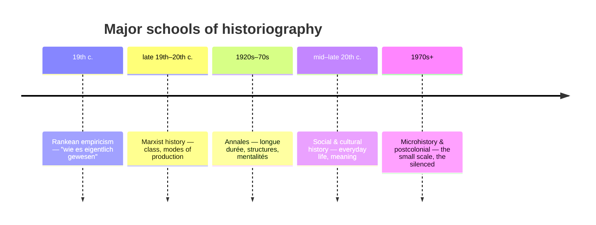

# Historiography and Historical Method

History is not the past; it is a disciplined argument *about* the past, built from
surviving evidence and always written from somewhere. **Historiography** is the study of
how history is produced — the sources, methods, assumptions, and rival schools that
shape what gets claimed and what gets left out. Before trusting any historical statement,
ask three questions: what evidence supports it, who selected and framed that evidence, and
whose experience the account centers.

## Sources and evidence

Historians distinguish **primary sources** (produced within the period under study —
charters, letters, inscriptions, coins, court rolls, oral testimony, material remains)
from **secondary sources** (later interpretations built on primaries). The distinction is
relational, not absolute: a nineteenth-century history of Rome is secondary for Rome but
primary for nineteenth-century thought.

Evidence is never neutral. It is **filtered twice** — first by *survival* (elites, states,
and literate societies leave far more records than the poor, the enslaved, or non-literate
cultures), and then by *selection* (the historian decides what to read and quote). Sound
method treats every source critically: establishing provenance and authenticity, reading
for the author's purpose and audience, distinguishing what a source *reveals* from what it
*intends*, and reading "against the grain" to recover the silenced. This close scrutiny of
evidence and its limits is a domain-specific case of the general logic of inference studied
in [philosophy-of-science](../philosophy/philosophy-of-science.md); where lost written
records fail entirely, the material record examined in
[archaeology-and-material-culture](../anthropology/archaeology-and-material-culture.md)
carries the argument — the only kind of evidence available for
[prehistory-and-human-origins](prehistory-and-human-origins.md).

## Periodization and the problem of narrative

To make the past legible, historians divide it into periods — "classical," "medieval,"
"early modern," "industrial." **Periodization is a tool, not a discovery.** Boundaries such
as the fall of Rome or the year 1500 are impositions that highlight some continuities and
obscure others, and most conventional schemes are quietly Eurocentric — a "middle age"
between antiquity and rebirth makes little sense for China, West Africa, or Mesoamerica.
Global history therefore treats periods as scaffolding to be questioned, not fact.

A related trap is **narrative** itself. Turning events into a story imposes coherence,
causation, and a beginning-middle-end that the past did not possess. Narrative is
indispensable for understanding, but it smuggles in interpretation: emplotment (tragedy,
triumph, decline) is a choice the historian makes, not a property of the events.

## Whose history gets told

For most of the discipline's life, history meant the deeds of states, elites, and men.
The twentieth century widened the frame: **social history** recovered ordinary lives,
**economic history** the material base, **women's and gender history** half of humanity,
and **postcolonial history** insisted that the archive itself encodes the perspective of
conquerors and administrators. Global and world history push against the nation-state as
the default unit, favoring connections, comparisons, and flows — the approach taken in
[trade-networks-and-cross-cultural-exchange](trade-networks-and-cross-cultural-exchange.md).

## Schools of historical thought

- **Rankean empiricism.** Leopold von Ranke professionalized history around the archive
  and source criticism, aspiring to show the past "as it actually was." His rigor endures;
  his confidence in objectivity does not.
- **Marxist history.** Reads the past through material forces — class conflict, modes of
  production, the economic base shaping the political and ideological superstructure. It
  supplied the vocabulary of structure and power still central to the field.
- **The Annales school.** Braudel and colleagues shifted attention from events (*histoire
  événementielle*) to slow-moving structures — geography, climate, demography — over the
  ***longue durée***, and to collective *mentalités*.
- **Social and cultural history.** Recovered the lives, beliefs, and meanings of ordinary
  people; cultural history in particular treats past worldviews as systems of meaning to be
  interpreted, converging with the interpretive turn in anthropology.
- **Microhistory.** Zooms in on a single village, trial, or person, using the miniature to
  illuminate the whole — trading breadth for depth and the texture of lived experience.

These approaches are cumulative, not successive: a working historian may use archival
rigor, structural analysis, and attention to the silenced all at once. The largest-scale
ambitions — reading the human story across millennia — belong to
[big-history-and-theories-of-history](big-history-and-theories-of-history.md).

## Why it matters

Method is what separates history from myth and propaganda. Understanding historiography
lets a reader weigh claims about the past instead of consuming them, recognize the frame a
narrative imposes, and notice whose voice is missing. It is the foundational literacy for
everything else in this folder.

## References

- [herodotus-histories](herodotus-histories.md) — the earliest self-conscious attempt to
  inquire, weigh sources, and explain rather than merely chronicle.
- [big-history-and-theories-of-history](big-history-and-theories-of-history.md)
- [philosophy-of-science](../philosophy/philosophy-of-science.md)
