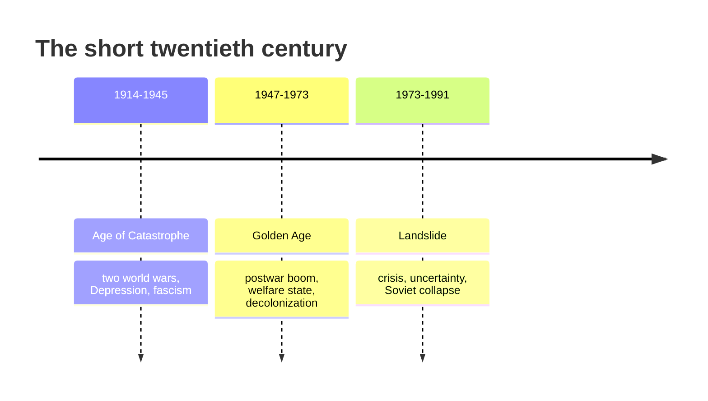

# The Age of Extremes: The Short Twentieth Century, 1914–1991

Eric Hobsbawm's *The Age of Extremes* (1994) is the capstone of the British Marxist
historian's four-volume history of the modern world. It offers a synthesizing account of
the twentieth century as he lived through it, written with the interpretive confidence of a
scholar who saw both world wars, the rise and fall of Soviet communism, and the postwar
transformation of the West.

## The "short twentieth century"

Hobsbawm's periodizing move is his most cited contribution. Against the calendar, he defines
a **"short twentieth century"** running from the outbreak of **World War I in 1914** to the
**collapse of the Soviet bloc in 1991**. This deliberately mirrors his earlier "long
nineteenth century" (1789–1914), covered in his trilogy *The Age of Revolution*, *The Age of
Capital*, and *The Age of Empire*. The century is bracketed, in other words, by the two great
ruptures that opened and closed the era of world war and communist revolution — the framing
that anchors
[the-twentieth-century-wars-and-cold-war.md](the-twentieth-century-wars-and-cold-war.md).

## Three-part structure

He divides the short century into three phases:

1. **The Age of Catastrophe (1914–1945)** — the two world wars, the Great Depression, and
   the rise of fascism, when liberal capitalist civilization nearly destroyed itself and
   was arguably saved only by its temporary alliance with Soviet communism against Nazism.
2. **The Golden Age (c. 1947–1973)** — an unprecedented quarter-century of economic growth,
   full employment, welfare states, and social transformation across the developed world,
   alongside decolonization in the global South.
3. **The Landslide (1973–1991)** — the unraveling: economic crisis, ideological
   uncertainty, the erosion of old social structures, and the final collapse of the Soviet
   system, which for Hobsbawm marked not a triumph but the closing of the century's central
   drama.

## Interpretation and significance

The book is a **Marxist synthesis**, though a heterodox and worldly one. Hobsbawm judges the
century by the disastrous failures of its three great projects — **state socialism,
capitalism, and nationalism** — and is skeptical of triumphalist readings of the West's Cold
War victory. He is equally unsentimental about developments in the arts and society. What
gives the book its authority is its combination of global economic, political, and cultural
history under a single argument, and Hobsbawm's own vantage as a participant-observer of the
age he analyzes.

## Critical reception

*The Age of Extremes* is widely regarded as a landmark of twentieth-century historiography
for its scope and analytical power. Criticism concentrates on its **political standpoint**:
as a lifelong communist, Hobsbawm was faulted by some reviewers for treating Soviet failures
too gently relative to Western ones, and for an interpretive frame that foregrounds class and
economic structure. Debating exactly this — how a historian's commitments shape the story
they tell — is itself instructive for
[historiography-and-historical-method.md](historiography-and-historical-method.md).

## References

- [The Age of Extremes — Penguin Random House](https://www.penguinrandomhouse.com/books/80963/the-age-of-extremes-by-eric-hobsbawm/)
