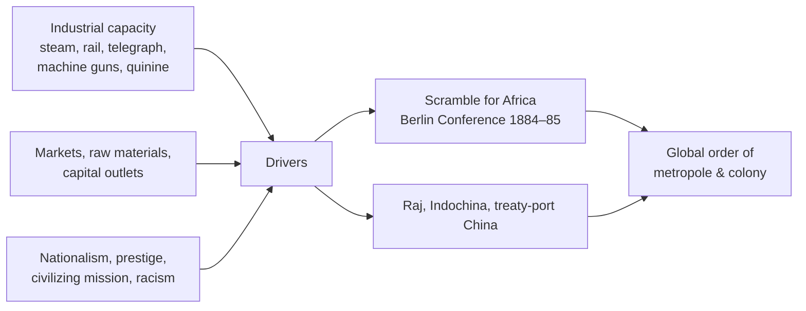

# Imperialism and Nationalism

The "long nineteenth century" (roughly 1789–1914) was dominated by two forces that pulled
in opposite directions yet reinforced each other: **nationalism**, which fragmented old
dynastic empires into nation-states, and **imperialism**, which knit most of the planet
into a handful of overseas empires. Together they built the modern global order — and
its deep inequalities. Both grew directly out of the transformations of
[revolutions-enlightenment-and-industrial.md](revolutions-enlightenment-and-industrial.md):
industrial power supplied the ships, guns, and railways of conquest, while the revolutionary
idea of popular sovereignty supplied nationalism's core claim.

## Nationalism: the nation-state as the default political unit

Before 1800 most people lived under multiethnic empires or local lordships. Over the
century, the idea that a people sharing language, history, or culture should govern
themselves in a bounded state became hegemonic — the unification of Italy (1861) and
Germany (1871), the nationalist stirrings inside the Ottoman, Habsburg, and Russian empires.
Historians frame nationhood as **constructed rather than natural**: Benedict Anderson's
"imagined communities" (built by print, census, map, and museum) and Ernest Gellner's
argument that industrial society *needs* the standardizing nation-state. Nationalism is one
of the modern ideological families traced in
[../political-science/political-theory-and-ideologies.md](../political-science/political-theory-and-ideologies.md);
it can be liberal and emancipatory or exclusionary and violent, and the same movement often
is both.

## Imperialism: the world carved up

Industrial capitalism drove a "new imperialism" of unprecedented scale and speed:

By 1914 a few European powers — plus the rising empires of the United States and **Japan**
(the Meiji state industrialized and then colonized in turn) — ruled or dominated most of
Africa, South and Southeast Asia, and the Pacific. The **"Scramble for Africa,"** ratified
at the Berlin Conference (1884–85), partitioned a continent with lines drawn in European
capitals. Economic historians debate whether empire "paid": for the metropolitan economy as
a whole the returns were often modest, even as specific investors, settlers, and firms
enriched themselves and colonized economies were reshaped for extraction rather than
development.

## Resistance and anti-colonialism

Empire was never uncontested. From the Indian Rebellion of 1857, to Ethiopia's defeat of
Italy at Adwa (1896), to countless local revolts, colonized peoples resisted from the start.
Crucially, the colonized also **turned the colonizers' own ideas against them**: Enlightenment
rights and European-style nationalism became the language of anti-colonial movements that
would win independence in the twentieth century. The seeds sown here germinate in the
decolonization surveyed in
[the-twentieth-century-wars-and-cold-war.md](the-twentieth-century-wars-and-cold-war.md).

## Historiographical debates

- **What drove imperialism?** Economic (Hobson–Lenin: empire as capitalism's outlet),
  geopolitical (great-power rivalry), cultural/ideological (the "civilizing mission," racial
  hierarchy), and "peripheral" theories (crises on the frontier pulling reluctant metropoles
  in) all compete; most historians now blend them.
- **Legacies of colonialism.** How much of present global inequality is colonial in origin?
  Dependency and world-systems theory (Wallerstein) see a structural core–periphery
  division created then; critics stress domestic institutions and later choices.
- **Postcolonial critique.** Edward Said's *Orientalism* and the subaltern-studies school
  reframed empire as a matter of *knowledge and representation*, not just economics and armies —
  and questioned whether the archive can even recover the colonized voice.

## Why it matters

The borders, resource flows, languages, and grievances of today's world were substantially
drawn in this period. The nation-state remains the basic unit of world politics (see
[../political-science/political-theory-and-ideologies.md](../political-science/political-theory-and-ideologies.md)),
and the metropole–periphery inequalities forged by empire structure the global economy and
the twentieth-century conflicts that followed in
[the-twentieth-century-wars-and-cold-war.md](the-twentieth-century-wars-and-cold-war.md).

## References

Concept note — synthesized from the field of world history. See anchor work
[mcneill-rise-of-the-west.md](mcneill-rise-of-the-west.md) and, on the deep origins of
global inequality, [diamond-guns-germs-and-steel.md](diamond-guns-germs-and-steel.md).
