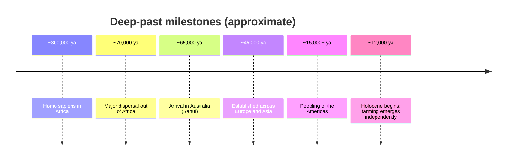

# Prehistory and Human Origins

**Prehistory** is the vast stretch of the human past that precedes writing — roughly
99.9% of the story of our species and its ancestors. Because there are no documents, it
cannot be studied by the source-criticism at the heart of
[historiography-and-historical-method](historiography-and-historical-method.md). Instead it
is reconstructed from *things*: bones, stone tools, hearths, pigments, ancient DNA, and
the chemistry of teeth. The evidentiary tools belong to
[archaeology-and-material-culture](../anthropology/archaeology-and-material-culture.md) and
[human-evolution-and-biological-anthropology](../anthropology/human-evolution-and-biological-anthropology.md);
the interpretive frame is [evolution-by-natural-selection](../biology/evolution-by-natural-selection.md).
Prehistory is where history, anthropology, and biology are a single inquiry.

## Human evolution in brief

Anatomically modern *Homo sapiens* emerged in Africa roughly 300,000 years ago, one branch
of a bushy hominin lineage that had been diverging for millions of years — australopithecines,
*Homo erectus*, Neanderthals, Denisovans, and others. Key transitions unfolded gradually:
upright walking (bipedalism), an enlarging brain, tool use, and control of fire. For most of
this span multiple human species coexisted; that we are now the only surviving one is a
recent and contingent fact, not an inevitability — a theme developed in
[harari-sapiens](harari-sapiens.md).

## Out of Africa and the peopling of the world

Modern humans dispersed out of Africa in waves, the major expansion beginning perhaps
70,000–60,000 years ago, and within tens of millennia had reached nearly every habitable
landmass — an astonishingly fast colonization of the planet.

Genetics has rewritten this map. Ancient-DNA studies show interbreeding with Neanderthals
and Denisovans (non-African populations carry a few percent of their DNA), repeated
migrations and mixtures rather than clean family trees, and a human species that is
genetically remarkably uniform — a young species descended from small ancestral populations.
The differential timing and geography of these dispersals set up starting conditions that
[diamond-guns-germs-and-steel](diamond-guns-germs-and-steel.md) argues echoed for millennia.

## Paleolithic foragers and behavioral modernity

For the whole Paleolithic ("Old Stone Age") humans lived as mobile **foragers** — hunting,
gathering, and fishing in small, mobile, relatively egalitarian bands. This was not a
"primitive" prelude but a durable and successful way of life that shaped human bodies,
minds, and social instincts.

Around 100,000–40,000 years ago the archaeological record blooms with signs of **behavioral
and cognitive modernity**: standardized and composite tools, long-distance exchange of raw
materials, ornaments and personal adornment, deliberate burial, and symbolic art such as
the cave paintings of Europe and Southeast Asia. Whether this reflects a sudden cognitive
"revolution" (Harari's emphasis on a new capacity for shared fiction and language) or a
slower accumulation visible earlier in Africa is actively debated — a debate that turns on
how one reads gaps in a patchy record.

## The limits of a written-source-free past

Prehistory is an argument built from absence as much as evidence. Preservation is uneven —
stone and bone survive, wood and cloth and language do not — so entire domains of past life
are invisible. Dating carries uncertainty, and the temptation to project present categories
(gender roles, "tribes," warfare) onto foragers is strong and often wrong. Conclusions are
therefore held provisionally, revised with each new site or genome. This is honest
epistemic humility of the kind examined in
[philosophy-of-science](../philosophy/philosophy-of-science.md): strong inference from
fragmentary data, always open to revision.

## Why it matters

Prehistory is the baseline. The forager lifeway is the condition under which human nature
evolved, and everything conventionally called "history" — cities, states, writing, empire —
is a thin recent film atop it. The break that ends this era is
[the-agricultural-revolution](the-agricultural-revolution.md), when settling down and
farming set humanity on the path to
[early-civilizations](early-civilizations.md).

## References

- [human-evolution-and-biological-anthropology](../anthropology/human-evolution-and-biological-anthropology.md)
- [evolution-by-natural-selection](../biology/evolution-by-natural-selection.md)
- [harari-sapiens](harari-sapiens.md)
- [diamond-guns-germs-and-steel](diamond-guns-germs-and-steel.md)
