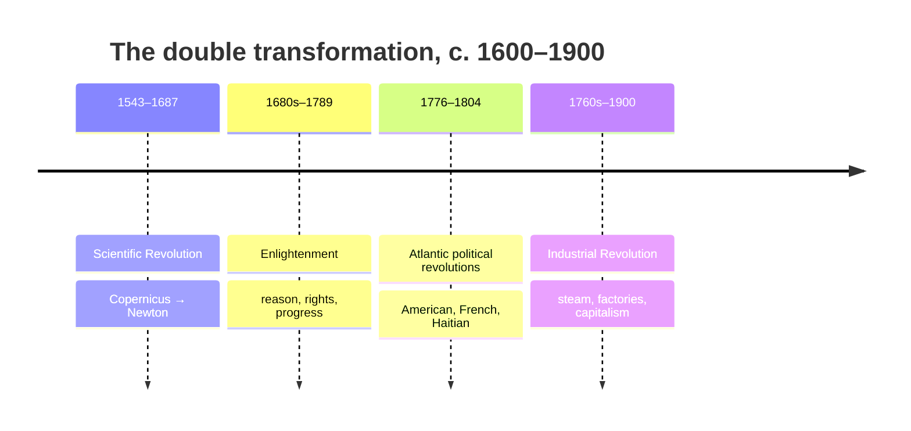

# Revolutions — Enlightenment and Industrial

Between roughly 1600 and 1900 a small corner of the world underwent a **double
transformation** that reorganized how humans think, how they are governed, and how they
produce wealth. Neither change was inevitable and neither was purely European in origin,
but their convergence in the North Atlantic produced what historians simply call **the
modern world**. The era is best read not as a single event but as three interlocking
revolutions — one in knowledge, one in politics, one in economy — each feeding the next.

## Three revolutions, one arc

### 1. The Scientific Revolution — a new theory of knowledge

From Copernicus's heliocentrism (1543) through Newton's *Principia* (1687), European
natural philosophers replaced inherited authority (Aristotle, scripture) with a method
grounded in observation, mathematics, and repeatable experiment. The lasting product was
not any single law but an **epistemology**: knowledge is provisional, testable, and
cumulative. That method is the direct ancestor of what we now call science — see
[../philosophy/philosophy-of-science.md](../philosophy/philosophy-of-science.md) and the
field hub [../philosophy/index.md](../philosophy/index.md). Historians caution against a
triumphalist story: the "revolution" borrowed heavily from Islamic astronomy and
mathematics, from Indian and Chinese numeracy, and from the practical knowledge of
navigators and instrument-makers — a global inheritance, not a European invention.

### 2. The Enlightenment — reason applied to society

The eighteenth-century Enlightenment took the confidence of the new science and turned it
on human affairs. Thinkers such as Locke, Montesquieu, Voltaire, Rousseau, Kant, and Smith
argued that reason, not tradition or divine right, should ground government, law, economics,
and morality. Core ideas — natural rights, the social contract, separation of powers,
religious toleration, free inquiry, progress — became the vocabulary of modern politics.
These are the seedbed of the modern ideological families surveyed in
[../political-science/political-theory-and-ideologies.md](../political-science/political-theory-and-ideologies.md).
Recent scholarship stresses the movement's contradictions: the same era that proclaimed
universal rights also rationalized slavery, empire, and new racial hierarchies — tensions
that the political revolutions would expose.

### 3. The Atlantic political revolutions

Enlightenment principles were put to the test in a wave of revolutions around the Atlantic:

| Revolution | Dates | What it tested |
|---|---|---|
| American | 1775–1783 | Whether a republic could be founded on natural rights and consent |
| French | 1789–1799 | Whether an old-regime society could be rebuilt on liberty, equality, fraternity |
| Haitian | 1791–1804 | Whether "universal" rights truly meant *universal* — the only successful large slave revolt, founding the first Black republic |

The Haitian Revolution is the crucial corrective to a Eurocentric reading: enslaved people
took the Declaration of the Rights of Man literally and forced the question the metropole
would not answer. Together these revolutions established the **nation-state grounded in
popular sovereignty** as the template that the nineteenth century would spread and contest
(see [imperialism-and-nationalism.md](imperialism-and-nationalism.md)).

### 4. The Industrial Revolution — a new mode of production

Beginning in Britain around the 1760s, mechanized spinning, the coal-fired steam engine,
and the factory system broke the millennia-old ceiling on productivity. For the first time,
output per person grew *persistently* rather than being periodically erased by Malthusian
limits — the hinge event behind modern
[../economics/economic-growth.md](../economics/economic-growth.md). Industrialization
brought the factory, wage labor, industrial **capitalism**, mass **urbanization**, and a
new class structure of bourgeoisie and proletariat. It also brought child labor, slums,
pollution, and the beginnings of the fossil-fuel dependence that defines the Anthropocene.

## Historiographical debates

- **Why Europe, why then?** The "Great Divergence" debate (Pomeranz, Wong) argues that as
  late as 1750 the most advanced regions of China and India were comparably rich; Britain's
  lead owed much to accessible coal and to New World resources extracted through slavery and
  colonies — not to unique European genius. Older internalist accounts stress institutions,
  property rights, and Enlightenment culture. Contrast the geographic-determinist frame of
  [diamond-guns-germs-and-steel.md](diamond-guns-germs-and-steel.md) with the diffusionist
  synthesis of [mcneill-rise-of-the-west.md](mcneill-rise-of-the-west.md).
- **Continuity vs. rupture.** Was this a sharp "revolution" or a slow accumulation? Economic
  historians increasingly favor gradual growth punctuated by acceleration.
- **Winners and losers.** The living-standards debate ("optimists" vs. "pessimists") asks
  whether early industrialization improved workers' lives or immiserated them before the
  gains arrived.

## Why it matters

Almost every feature of the contemporary world — representative government, human-rights
discourse, science-driven technology, sustained economic growth, industrial capitalism,
and the ecological crisis — traces to this double transformation. It set in motion the
uneven global order examined in [imperialism-and-nationalism.md](imperialism-and-nationalism.md)
and, before it, grew out of the connected world of
[early-modern-and-global-connection.md](early-modern-and-global-connection.md).

## References

Concept note — synthesized from the field of world history. See anchor works
[mcneill-rise-of-the-west.md](mcneill-rise-of-the-west.md) and
[diamond-guns-germs-and-steel.md](diamond-guns-germs-and-steel.md).
