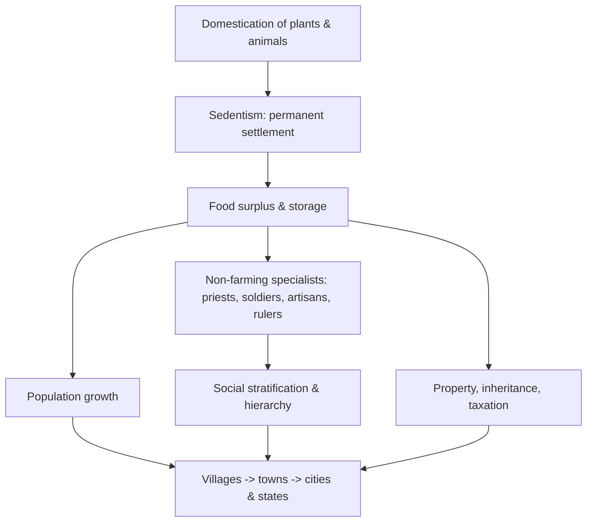

# The Agricultural Revolution

Beginning around 12,000 years ago, in the warmer and more stable climate of the Holocene,
human groups in several parts of the world independently began to **domesticate plants and
animals** and to settle in one place. This **Neolithic ("New Stone Age") Revolution** was
the deepest change in the human condition since our species evolved — the hinge between the
forager world of [prehistory-and-human-origins](prehistory-and-human-origins.md) and the
crowded, stratified world of [early-civilizations](early-civilizations.md). Its causes,
consequences, and even its status as "progress" are all contested.

## Domestication and its multiple origins

Domestication is a slow, reciprocal evolutionary process — humans reshaping wild species
through selective breeding while those species reshaped human life. It is
[evolution-by-natural-selection](../biology/evolution-by-natural-selection.md) redirected
by human choice (artificial selection). Crucially, farming arose **independently** in at
least a handful of separate hearths, from local wild species, showing it was not a single
invention that diffused but a threshold several societies crossed on their own.

| Hearth | Approx. onset | Signature domesticates |
| --- | --- | --- |
| Fertile Crescent (SW Asia) | ~11,000 ya | wheat, barley, sheep, goats, cattle |
| East Asia (China) | ~9,000 ya | rice, millet, pigs |
| Mesoamerica | ~9,000 ya | maize, beans, squash |
| Andes / Amazonia | ~7,000+ ya | potato, quinoa, llama |
| New Guinea | ~9,000 ya | taro, banana |
| Sub-Saharan Africa (Sahel) | ~5,000 ya | sorghum, pearl millet, yams |

[diamond-guns-germs-and-steel](diamond-guns-germs-and-steel.md) argues that these hearths
were not equally endowed: the Fertile Crescent and Eurasia had more domesticable large
mammals and high-yield grains, and Eurasia's **east–west axis** let crops and animals
spread across shared latitudes and climates far more easily than along the Americas' or
Africa's north–south axes. On this account the uneven geography of domestication, not any
difference between peoples, set the long-run trajectory — a geographic-determinist thesis
that critics say discounts culture, contingency, and human agency.

## The chain of consequences

Settling down (**sedentism**) allowed food to be stored, which supported larger and denser
populations, which in turn could feed people who did *not* farm — the first priests,
soldiers, artisans, scribes, and rulers. Storable, seizable surplus made durable
inequality, property, and taxation possible. Together these produced the raw materials of
the first states and cities examined in [early-civilizations](early-civilizations.md). The
physical traces of this transition — grinding stones, granaries, pottery, village
architecture, animal bones — are the working evidence of
[archaeology-and-material-culture](../anthropology/archaeology-and-material-culture.md).

## History's biggest fraud?

The word "revolution" and the older story of farming as unambiguous progress both deserve
scrutiny. [harari-sapiens](harari-sapiens.md) provocatively calls the Agricultural
Revolution **"history's biggest fraud"**: measured by individual well-being, early farmers
were often *worse off* than foragers — a narrower diet, more grueling labor, new
crowd-and-livestock diseases, worse average health and stature, and vulnerability to crop
failure and famine. Harari's inversion is that we did not domesticate wheat so much as
wheat domesticated us: the species (and the elites atop the surplus) flourished while the
median human's daily life arguably degraded. Skeptics counter that the trade-offs varied by
region and that the metric matters — by population and by cumulative capability, farming was
transformative.

The transition was also uneven and reversible: many groups adopted farming partially, mixed
it with foraging, or abandoned it. "Neolithic Revolution" compresses a process that took
millennia into a single event — a reminder of the periodization caution in
[historiography-and-historical-method](historiography-and-historical-method.md).

## Why it matters

Almost everything we call civilization — cities, writing, states, organized religion,
armies, class, and the environmental footprint of humanity — rests on the agricultural
surplus. Understanding the revolution's trade-offs also reframes a modern intuition: "more
food and more people" is not the same as "better lives," a distinction with echoes for how
we judge progress today.

## References

- [harari-sapiens](harari-sapiens.md)
- [diamond-guns-germs-and-steel](diamond-guns-germs-and-steel.md)
- [archaeology-and-material-culture](../anthropology/archaeology-and-material-culture.md)
