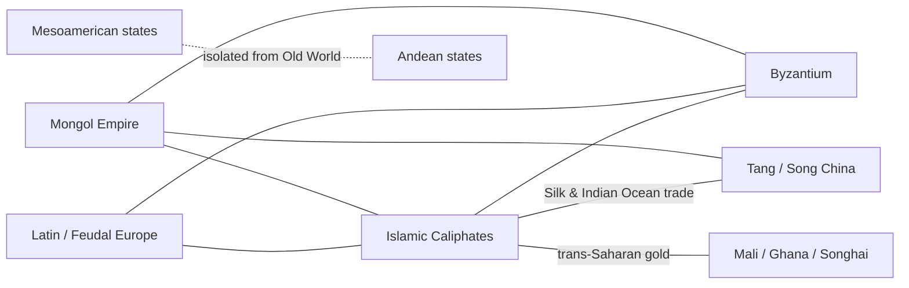

# The Medieval World

The **medieval** or "middle" period spans roughly **500–1500 CE** — the thousand years
between classical antiquity (see [classical-antiquity](classical-antiquity.md)) and the
early modern age (see [early-modern-and-global-connection](early-modern-and-global-connection.md)).
The term itself is a Renaissance insult: humanists coined *media aetas* to dismiss the
centuries between them and their beloved classics as a "middle" nothing. The related
label "Dark Ages" compounds the slur and is doubly misleading — it was coined for a
narrow slice of *western Europe* and then wrongly stretched over the whole world. A global
view inverts the picture entirely: for most of this millennium the dynamic, wealthy,
learned centers of Eurasia and Africa lay *outside* Christian Europe. The synthetic
narrative of [McNeill](mcneill-rise-of-the-west.md) — and later "big history" and
world-systems revisions of it — takes this connected, polycentric world as its subject.

## A polycentric world, not a European one

- **The Islamic Golden Age.** From the 8th century, the Abbasid Caliphate centered on
  Baghdad's *House of Wisdom* preserved and extended Greek, Persian, and Indian learning:
  algebra (*al-jabr*), optics, medicine, and the astronomy and mathematics later
  transmitted to Europe. Islam here is the religious matrix of a civilization, one branch
  of the [../religion/abrahamic-traditions.md](../religion/abrahamic-traditions.md).
- **Byzantium** — the surviving eastern Roman Empire — safeguarded Roman law and Greek
  literature and anchored Orthodox Christianity for a millennium after Rome's western fall.
- **Tang and Song China** are often the era's true center of gravity: printing,
  gunpowder, the compass, paper money, mass urbanization, and the mature examination
  bureaucracy. Song China may have been the most technologically advanced society on
  earth around 1000 CE.
- **Feudal Europe** was, by contrast, comparatively poor and fragmented — a decentralized
  order of lords, vassals, and manors (see
  [../political-science/forms-of-government.md](../political-science/forms-of-government.md))
  that only slowly recovered and, from c. 1000, urbanized and revived.
- **West African empires** — Ghana, Mali, and Songhai — grew rich on the trans-Saharan
  gold and salt trade; Mansa Musa's pilgrimage and Timbuktu's scholarship made Mali
  legendary across the Islamic world.
- **The Mongol Empire** (13th c.), the largest contiguous land empire in history,
  violently stitched Eurasia together, securing the routes that carried goods, ideas —
  and plague — described in
  [trade-networks-and-cross-cultural-exchange](trade-networks-and-cross-cultural-exchange.md).
- **Mesoamerican and Andean states** — Maya, later Aztec, and the Inca — built cities,
  empires, and monumental complexity in complete isolation from the Old World, a natural
  control case for theories of social development.

## Connection as the theme

The medieval world's defining feature is not stagnation but **connection**. The Silk
Roads, the Indian Ocean monsoon trade, and the trans-Saharan caravans knit these centers
into a pre-modern world-system, moving silk, spices, gold, technologies, and religions —
Islam and Buddhism especially — across continents. The same arteries carried the
**Black Death** (mid-14th c.), which killed perhaps a third of Eurasia's population and
reshaped economies and social structures from China to England. This connective tissue is
the subject of its own note,
[trade-networks-and-cross-cultural-exchange](trade-networks-and-cross-cultural-exchange.md).

## Historiographical debates

- **"Dark Ages" and "medieval" are loaded terms.** Both encode a Renaissance
  self-narrative; historians now use "medieval" descriptively while rejecting the
  pejorative freight.
- **How useful is "feudalism"?** Elizabeth Brown and Susan Reynolds argued the tidy
  pyramid of lord-and-vassal is a later scholarly construct imposed on messier realities.
- **Periodization is Eurocentric.** "500–1500" is calibrated to Europe's timeline; it fits
  China, the Islamic world, or the Americas only awkwardly, a reminder that periods are
  tools, not facts.
- **Where was the center?** World historians increasingly place the era's economic and
  intellectual center in Song China and the Islamic world, treating Europe as a peripheral
  latecomer — a direct challenge to the older "rise of the West" framing.

## Why it matters

Seeing the medieval world as connected and polycentric dismantles the myth of a European
"dark age" and reframes the later European ascendancy as a *contingent, late* development
rather than a foregone conclusion. It also supplies the deep background for the global
economy that follows (see [../economics/index.md](../economics/index.md)): the routes,
institutions, and appetites of the early modern world were built on medieval foundations.

## References

- Concept note — synthesized from the general historiography of the medieval world; no
  single source. Anchored to [McNeill](mcneill-rise-of-the-west.md) and cross-linked to
  [classical-antiquity](classical-antiquity.md),
  [trade-networks-and-cross-cultural-exchange](trade-networks-and-cross-cultural-exchange.md),
  [early-modern-and-global-connection](early-modern-and-global-connection.md), and
  [../religion/abrahamic-traditions.md](../religion/abrahamic-traditions.md).
