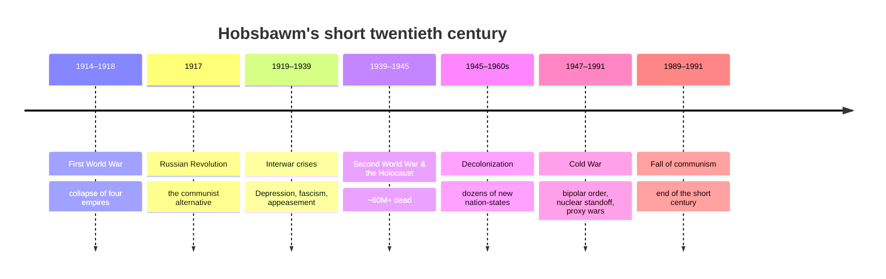

# The Twentieth Century — Wars and Cold War

Eric Hobsbawm called it the **"short twentieth century"** — running from 1914 to 1991, from
the outbreak of the First World War to the collapse of the Soviet Union — and the **"Age of
Extremes,"** a century of unprecedented violence and unprecedented gains lived side by side.
This note takes his framing as its anchor (see
[hobsbawm-age-of-extremes.md](hobsbawm-age-of-extremes.md)). More people were killed by war
and state violence than in any prior era, yet the same century roughly doubled human life
expectancy, decolonized most of the planet, and put a human on the Moon. The organizing
thread was an **ideological contest** — liberal capitalism, communism, and fascism — fought
first with armies and then with proxies, aid, and propaganda.

## The arc of the short century

### Total war and its aftermath (1914–1945)

The **First World War** shattered the confident order of nineteenth-century Europe, toppled
the German, Austro-Hungarian, Ottoman, and Russian empires, and — through the punitive peace
and the **Russian Revolution** (1917) — set up the century's central conflicts. The
**interwar** years brought the Great Depression, which discredited liberal capitalism for many
and fueled the rise of **fascism** (Mussolini, Hitler) and militarism. The **Second World War**
(1939–1945) was the deadliest conflict in history, and within it the **Holocaust** — the
industrialized, bureaucratized genocide of six million Jews and millions of others — stands as
the century's moral abyss and the reason terms like *genocide* and *crimes against humanity*
entered international law.

### Decolonization

The war bankrupted the European empires and delegitimized the racial hierarchies that
justified them. Between the late 1940s and the 1970s, dozens of new states emerged across
Asia and Africa — India and Pakistan (1947), a wave of African independence around 1960 — often
through movements that had turned Enlightenment and nationalist ideas against their colonizers
(the direct sequel to [imperialism-and-nationalism.md](imperialism-and-nationalism.md)).
Independence was frequently followed by the hard problems of state-building, Cold War
entanglement, and borders inherited from empire.

### The Cold War

From 1947 to 1991 a **bipolar order** pitted the United States and its allies against the
Soviet Union in a rivalry that was ideological (capitalism vs. communism), military (a nuclear
arms race under mutually assured destruction), and global. Direct great-power war was avoided —
the "long peace" — but the conflict was fought hot in **proxy wars** (Korea, Vietnam,
Afghanistan) and through coups, aid, and espionage across the decolonizing world. The dynamics
of alliance, deterrence, and bipolarity are the raw material of
[../political-science/international-relations.md](../political-science/international-relations.md).
The Soviet bloc collapsed in 1989–1991, which Hobsbawm treats as the true end of the century.

## Historiographical debates

- **Origins of the First World War.** Deliberate German bid for dominance (Fritz Fischer) vs.
  a system of alliances that stumbled into catastrophe — a debate about agency vs. structure
  that recurs throughout the field (see
  [historiography-and-historical-method.md](historiography-and-historical-method.md)).
- **Explaining the Holocaust.** "Intentionalist" (a long-planned program) vs.
  "functionalist" (a cumulative radicalization) accounts, and Hannah Arendt's contested
  "banality of evil."
- **Who caused the Cold War?** Orthodox (Soviet expansionism), revisionist (US economic
  and nuclear assertiveness), and post-revisionist (a security dilemma neither side controlled)
  schools.
- **A century of progress or catastrophe?** Hobsbawm's own ambivalence — extraordinary
  material and social advance entangled with extraordinary destruction — remains the defining
  interpretive tension.

## Why it matters

The institutions and fault lines of the present were forged here: the United Nations, the
human-rights regime, the nuclear taboo, the postcolonial state system, and the alignments and
grievances that still shape world politics. The century's end opens directly onto
[globalization-and-the-contemporary-world.md](globalization-and-the-contemporary-world.md).

## References

Concept note — synthesized from the field of world history. Anchor work:
[hobsbawm-age-of-extremes.md](hobsbawm-age-of-extremes.md).
