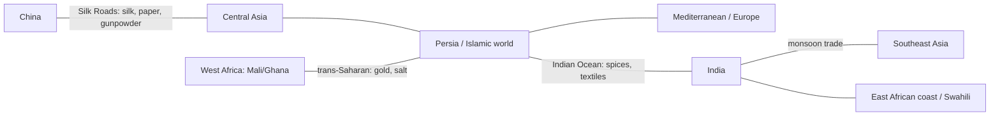

# Trade Networks and Cross-Cultural Exchange

Trade networks are the **connective tissue of world history** — the arteries along which
goods, technologies, religions, ideas, people, and diseases moved between civilizations
long before the modern global economy. Where earlier textbooks told history as a set of
separate societies, world historians tell it as a story of *connection*: the interesting
questions are how far, how fast, and to what effect things crossed cultural boundaries.
Fernand Braudel's study of pre-industrial economic life
([braudel-civilization-and-capitalism.md](braudel-civilization-and-capitalism.md)) is a
touchstone here — his layered model of everyday material life, market economy, and
long-distance capitalism gives the analytic vocabulary for reading these exchanges (see
also [../economics/index.md](../economics/index.md)).

## The great pre-modern circuits

- **The Silk Roads** — overland routes linking China, Central Asia, Persia, and the
  Mediterranean — carried silk, paper, and gunpowder westward and, crucially, **Buddhism**
  eastward into China and beyond. Few merchants traveled the whole length; goods and ideas
  passed hand to hand across relay networks.
- **Indian Ocean trade** was likely the era's largest and richest system, powered by the
  predictable **monsoon winds**. It bound East Africa's Swahili coast, Arabia, India, and
  Southeast Asia in a commerce of spices, textiles, and gold, and it was the principal
  highway for the spread of **Islam** across the Indian Ocean rim.
- **Trans-Saharan routes** moved West African gold and forest goods north and Saharan salt
  and North African wares south, financing the empires of Ghana, Mali, and Songhai and
  linking sub-Saharan Africa into the Islamic world.

## What moved — and its consequences

Exchange was never just commercial. Along the same routes traveled:

- **Religions** — Buddhism along the Silk Road; Islam across the Indian Ocean and Sahara;
  Christianity, Manichaeism, and others (see
  [../religion/comparative-religion-and-world-traditions.md](../religion/comparative-religion-and-world-traditions.md)).
- **Technologies** — paper, printing, gunpowder, the compass, and mathematical and
  agricultural knowledge diffusing across Eurasia.
- **Disease.** The **Black Death** (mid-14th c.) is the darkest case: plague moved along
  the very trade and Mongol-secured routes that carried silk, killing perhaps a third of
  Eurasia's population and reshaping labor, wages, and society from China to England. The
  same connectivity that spread prosperity spread catastrophe.

## World-systems before the modern one

The "world-systems" framework (Immanuel Wallerstein) originally described the
Europe-centered capitalist economy after 1500. Historians such as **Janet Abu-Lughod**
argued that a **thirteenth-century world-system** — an interlocking set of overlapping
trade circuits from China to Europe, with *no single dominant center* — already existed
before Europe's rise. This reframes European dominance as a *later* development that
plugged into and eventually reoriented pre-existing Afro-Eurasian networks, rather than
inventing world trade. It directly links the connected medieval world (see
[the-medieval-world](the-medieval-world.md)) to the first truly global economy that
follows (see [early-modern-and-global-connection](early-modern-and-global-connection.md)).

## Historiographical debates

- **How integrated was the pre-modern world?** Scholars differ on whether these circuits
  formed a genuine "system" or a looser chain of regional exchanges.
- **When did Europe pull ahead — and why?** The "Great Divergence" debate (Kenneth
  Pomeranz and others) asks whether Europe and East Asia were roughly comparable until c.
  1800, making European dominance recent and contingent rather than deep-rooted.
- **Was exchange mutual or extractive?** The balance of benefit along these routes — and
  the violence embedded in some of them — is contested and varied by circuit and era.

## Why it matters

Understanding trade networks turns world history from a set of parallel stories into a
single interconnected one. It explains how technologies and religions spread, how the most
lethal pandemic in history traveled, and how the modern global economy grew out of far
older circuits — grounding the claim that connection, not isolation, has been the normal
human condition. For the economic machinery behind these exchanges, see
[../economics/index.md](../economics/index.md); for the human curiosity about foreign
peoples that trade always provoked, [Herodotus](herodotus-histories.md) is the ancestor.

## References

- Concept note — synthesized from world-trade historiography; no single source. Anchored
  to [braudel-civilization-and-capitalism.md](braudel-civilization-and-capitalism.md) and
  cross-linked to [the-medieval-world](the-medieval-world.md),
  [early-modern-and-global-connection](early-modern-and-global-connection.md), and
  [../economics/index.md](../economics/index.md).
