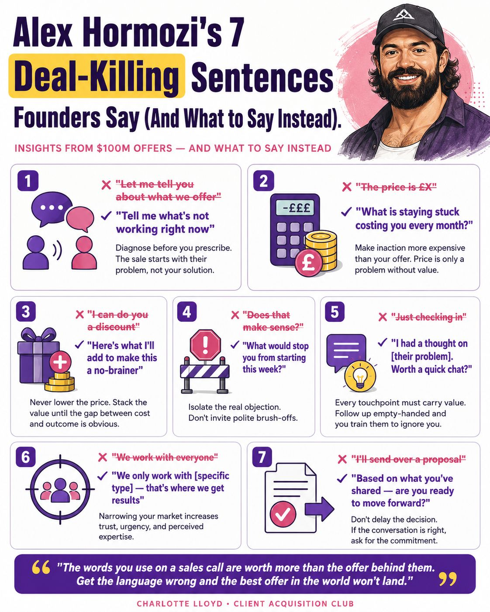

# Alex Hormozi's 7 Deal-Killing Sentences

Seven things founders say on sales calls that kill deals, and what to say instead
(insights from $100M Offers; via Charlotte Lloyd / Client Acquisition Club).

| # | Don't say | Say instead | Why |
|---|---|---|---|
| 1 | "Let me tell you about what we offer" | "Tell me what's not working right now" | Diagnose before you prescribe; start with their problem |
| 2 | "The price is £X" | "What is staying stuck costing you every month?" | Make inaction more expensive than your offer; price is only a problem without value |
| 3 | "I can do you a discount" | "Here's what I'll add to make this a no-brainer" | Never lower price; stack value until the cost/outcome gap is obvious |
| 4 | "Does that make sense?" | "What would stop you from starting this week?" | Isolate the real objection; don't invite polite brush-offs |
| 5 | "Just checking in" | "I had a thought on [their problem]. Worth a quick chat?" | Every touchpoint must carry value or you train them to ignore you |
| 6 | "We work with everyone" | "We only work with [specific type] — that's where we get results" | Narrowing your market increases trust, urgency, perceived expertise |
| 7 | "I'll send over a proposal" | "Based on what you've shared — are you ready to move forward?" | Don't delay the decision; if the conversation is right, ask for the close |

> "The words you use on a sales call are worth more than the offer behind them."

## References

- 
