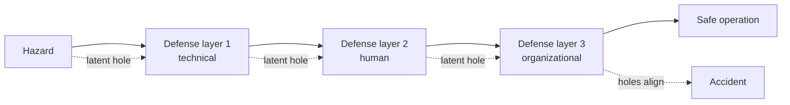

Richard Cook's 1998 treatise (subtitle: *how complex systems fail and what to do
about it*) is 18 terse observations on why systems in inherently hazardous
domains — medicine, aviation, power, and by extension software operations — break.
It has become foundational to how SRE and incident practice think about failure.
The essence: failure is not the exception that interrupts a healthy system; it is
a continuous property of a system that runs *because* people hold it together.

## The core observations

1. **Complex systems are intrinsically hazardous.** The interesting systems are
   irreducibly dangerous by nature; that hazard is what drives the construction of
   defenses in the first place.
2. **They are heavily and successfully defended against failure.** Layers of
   defense — technical (backups, safety features), human (training, knowledge),
   and organizational (policies, certification, work rules) — normally divert
   operations away from accidents.
3. **Catastrophe requires multiple failures; single-point failures are not
   enough.** Overt accidents happen only when several small, individually harmless
   failures line up. Each is *necessary* but only the combination is *sufficient*.
   There are far more failure opportunities than actual accidents because most
   trajectories are blocked — often by practitioners.
4. **Systems contain changing mixtures of latent failures.** They cannot run
   without flaws present. Latent failures are tolerated because each alone is
   harmless, and eradicating them all is limited by cost and by the impossibility
   of foreseeing which ones will combine. The mix keeps changing as technology,
   organization, and fix efforts change.
5. **Complex systems run in degraded mode.** They operate *as broken systems*,
   working only because of redundancy and human effort. Reviews almost always
   find a history of "proto-accidents" that nearly went catastrophic.

The remaining observations extend this: hindsight bias distorts post-accident
analysis (knowing the outcome makes the path look more obvious and avoidable than
it was); there is no single "root cause"; human practitioners are the *adaptable*
element that both creates and averts failures; and safety is an emergent property
of the whole system, not a component you can bolt on.

## The Swiss-cheese picture

Each defense has holes (latent failures). Normal operation succeeds because the
holes rarely align. Catastrophe is the moment they do.

## Why it matters for software

Cook reframes incidents away from "who screwed up" toward "which conditions
aligned." That directly motivates practices like the [blameless
post-mortem](blameless-post-mortems.md) — Allspaw's "second story" is Cook's
latent-failure view applied to operations. It also underpins the automation
concerns in [The Ironies of Automation](ironies-of-automation.md), and the
resilience thinking behind [architecting for scale](architecting-for-scale.md).

## References

- [How Complex Systems Fail — Richard I. Cook](https://how.complexsystems.fail/)
