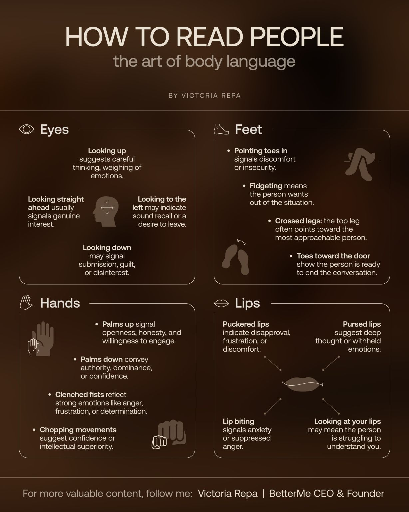

# How to Read People: The Art of Body Language

A nonverbal-cue reference (Victoria Repa, BetterMe) grouped by body region. Cues are
suggestive, not deterministic.

- **Eyes:** looking up = careful thinking / weighing emotions; straight ahead = genuine
  interest; to the left = sound recall or a desire to leave; down = submission, guilt,
  or disinterest.
- **Feet:** toes pointing in = discomfort/insecurity; fidgeting = wants out; crossed
  legs' top leg points to the most approachable person; toes toward the door = ready to
  end the conversation.
- **Hands:** palms up = openness/honesty; palms down = authority/dominance; clenched
  fists = anger/frustration/determination; chopping movements = confidence.
- **Lips:** puckered = disapproval/frustration; pursed = deep thought or withheld
  emotion; lip biting = anxiety or suppressed anger; looking at your lips = struggling
  to understand you.

## References

- 
