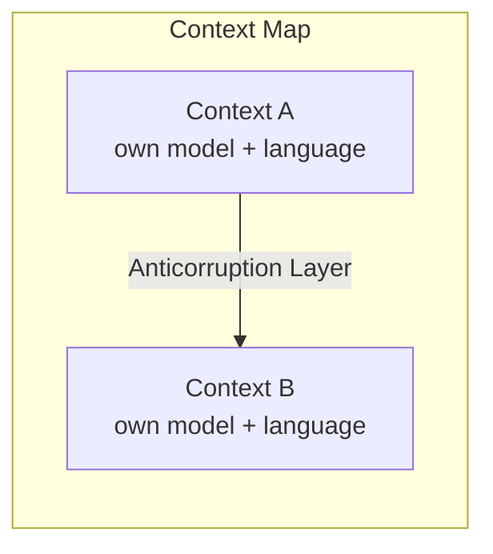

# Implementing Domain-Driven Design

Vaughn Vernon's 2013 book (the "red book") is the practical companion to Eric Evans's
original [Domain-Driven Design](domain-driven-design.md) (the "blue book"). Where Evans
established the *what* and *why*, Vernon focuses on the *how*: turning DDD's tactical and
strategic patterns into code you can actually ship, using a running SaaS example
(a project-collaboration product) followed across chapters.

## Strategic design comes first

Vernon's strongest editorial push is that teams routinely skip the strategic patterns
and jump straight to entities and repositories — and that this is backwards. The
high-leverage decisions are strategic:

- **Bounded Contexts** — explicit boundaries within which a model and its ubiquitous
  language are consistent. A term means exactly one thing inside a context. This is
  [Parnas information hiding](parnas-decomposing-systems-into-modules.md) at the scale of
  a subsystem: each context hides its model from the others.
- **Ubiquitous Language** — a shared, precise vocabulary spoken by developers and domain
  experts alike, expressed directly in the code of its context.
- **Context Maps** — how bounded contexts relate: integration patterns like
  Partnership, Customer/Supplier, Conformist, Anticorruption Layer, Open Host Service,
  and Published Language, plus the team relationships they imply.

## Tactical patterns, done carefully

Inside a bounded context, Vernon gives disciplined guidance on the building blocks:

- **Entities** (identity over time) vs. **Value Objects** (defined by their attributes,
  immutable, preferred where possible).
- **Aggregates** — the book's most-cited practical contribution. Vernon lays out rules
  for designing them well: model true invariants inside a *small* aggregate, **reference
  other aggregates by identity** rather than by object graph, and **update one aggregate
  per transaction**, using eventual consistency (often via domain events) across
  aggregates. Large aggregates are the classic DDD failure mode.
- **Domain Events** — first-class model of something that happened; the backbone of
  decoupled integration and of event-driven flows between contexts.
- **Domain Services**, **Repositories** (collection-like access to aggregate roots), and
  **Factories** for complex construction.

## Architecture and integration

Vernon situates the domain model inside supporting architecture — layered architecture,
[Hexagonal / Ports and Adapters](hexagonal-architecture-ports-and-adapters.md) to keep
the domain free of infrastructure, plus CQRS, event sourcing, and messaging as options
for how contexts integrate. The theme throughout: keep the domain model pure and let
adapters absorb the technical concerns.

## Related notes

- [Domain-Driven Design](domain-driven-design.md) — Evans's original; Vernon
  operationalizes it.
- [Hexagonal Architecture (Ports & Adapters)](hexagonal-architecture-ports-and-adapters.md)
  — Vernon's recommended way to isolate the domain.
- [Parnas — Decomposing Systems into Modules](parnas-decomposing-systems-into-modules.md)
  — a bounded context is information hiding at subsystem scale.
- [Patterns of Enterprise Application Architecture](patterns-of-enterprise-application-architecture.md)
  — the persistence and layering patterns DDD builds on.
- [Clean Architecture](clean-architecture.md) — same instinct to keep business rules
  independent of frameworks and I/O.

## References

- [Implementing Domain-Driven Design — Vaughn Vernon](https://www.oreilly.com/library/view/implementing-domain-driven-design/9780133039900/)
