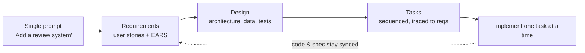

# Introducing Kiro

AWS's launch post for **Kiro**, an agentic AI IDE built to carry AI-built prototypes
*into production*. Its framing: prompt-prompt-prompt gives you a working app that feels
like magic, but production needs more — what assumptions did the model make? are they
documented? do you understand the design? Kiro's answer is **spec-driven development**,
positioned in the overlap between "the flow of [vibe coding](vibe-coding.md)" and "the
clarity of specs." A concrete implementation of
[spec-driven development](spec-driven-development.md); see also the tool comparison in
[Understanding SDD](understanding-sdd-kiro-spec-kit-tessl.md).

## Two headline features

### Specs — the three-step workflow

From a single prompt, Kiro generates a full spec in three synced markdown documents:

1. **Requirements** — unpacks the prompt into user stories, each with **EARS** (Easy
   Approach to Requirements Syntax) acceptance criteria that cover the edge cases
   developers usually handle by hand. This makes prompt *assumptions explicit*.
2. **Design** — a design document (component architecture diagram, data flow, data
   models, error handling, testing strategy, etc.).
3. **Tasks** — an auto-generated, dependency-sequenced task list, each task linked back
   to a requirement and detailed with unit/integration tests, loading states, mobile
   responsiveness, and accessibility. Tasks run one-by-one with a progress indicator;
   you audit via code diffs and agent execution history.

Crucially, **specs stay synced with the evolving codebase** — you can edit code and ask
Kiro to update the spec, or edit the spec to refresh tasks — attacking the classic
problem where original artifacts rot during implementation.

### Hooks

**Agent hooks** are event-triggered automations (e.g. run unit tests on every commit)
that offload repetitive work *out of* the spec — which also keeps the context window
from bloating.

## Notes

- Built on Code OSS, so VS Code settings and Open VSX plugins carry over.
- EARS acceptance criteria are Kiro's mechanism for turning fuzzy requirements into
  checkable ones — a lighter-weight cousin of the eval-driven grounding in
  [evals / LLM as a judge](evals-llm-as-a-judge.md).

## References
- [Introducing Kiro — Kiro (AWS)](https://kiro.dev/blog/introducing-kiro/)
